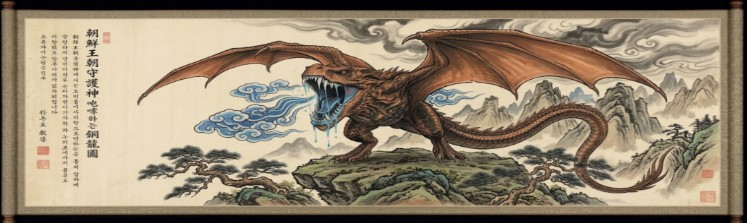

**Chapter 1: The Main Course**

---

The incense in the cathedral smelled like expensive cedar and old money, but beneath the thick smoke billowing from the incense burners, Yeongon could smell the decay as she glanced through white lace at the crowd in the pews.
“If there is anyone here who has anything to say about this union, speak now or forever hold your peace.” The clergyman paused, his gaze sweeping the vaulted ceiling, the stained-glass saints, and finally, the hundreds of faces packed into the mahogany pews.

 He was stalling, and it was painfully obvious by tugging repeatedly on his collar to let beads of sweat hide continue their journey down his neck. The entire congregation, or something along those lines, was more like a curated menagerie of board members, hedge fund managers, and society heirs and heiresses than a family. All sitting in a collective, suffocating silence, where only a forced wet cough from a child in the third row cut through the tension.

 
Beneath the French lace of her veil, Yeongon Barin, soon to be Woo Yeongon, smiled,  tilting her head toward her groom. Woo Arthur looked up at her, his neck muscles straining against the stiff collar of his custom Goodman tuxedo. Advanced stages of Parkinson's had already claimed his steadiness, even with multiple, top-of-the-line, treatments course within his body. His hands often shook like autumn leaves clinging to a dead branch in a gale, now it does so as he offers his hand to his young, beautiful and well-cultured bride. Yet, when his milky, cataract-clouded eyes met hers, they swarmed with the desperate, arrogant hope of a waning moon, who believed he had just purchased unlimited time on the Earth. She took it, her skin cool, smooth, and utterly devoid of a human pulse and it felt good on top of his, as it seemed everyone in the room was hot except for her.

“Fine! If no one else has the spine to say it then I guess it’ll have to be me!” A figure abrupt and sharp rose from the front pew. It was Jin, Woo’s twenty-six-year-old grandson. He bore rich, dark hair swept back with deliberate, effortless precision framed a face devoid of superfluous emotion, leaving behind only the cold, sharp elegance of calculated intent. Encased in a tailored charcoal-grey blue suit that fit with surgical precision over a crisp white shirt, his posture radiated an innate, unflinching authority. He didn't look like a heartbroken grandson, instead a CFO watching a hostile takeover. His fists were clenched at his sides, the form fitted tailored suit straining against his coiled stance. “Grandfather, just look at her!” Jin’s voice echoed off the marble pillars, stripped of any familial warmth, his hands framed her as if to exemplify her perfect frame next to his grandfather, a withering old man. Jin tone lowered to nearly conspiratory-level. “This is a predatory asset seizure dressed in white silk. She is half your age, with no pedigree and no background. You are signing away controlling interest in Woo Telecom to a literal nobody!”

A slight sneer that only she knew of curled under one nostril she thought to herself, _higher society comes down to mere messy, flailing animals, after all._ The old man’s jaw trembled as he tried to summon the breath for a retort, his face flushing a dangerous, apoplectic purple. 

But before he could speak, Yeongon’s voice floated across the altar. It wasn’t loud, but it carried an unnatural weight, slipping effortlessly into every ear in the sanctuary without having to crane her neck.  “You needn't worry about your portfolio, Jin,” She said, her tone dripping with honeyed sorrow. “I have already signed the prenup. That in and of itself relinquishes my claim to the generational trusts. I care nothing about your 'trust-fund' or your position at Woo Telecom.” She paused and turned her focus on the clergyman as if pleading with him. “I only want to love Arthur, and to care for him in his twilight.”

She turned her gaze back to her groom, staring longingly, if not hungrily, into his watery eyes and Arthur’s chest puffed out, instantly validated. He threw a sneer of triumph back at his grandson, who sank into the pew, blinking in confusion and cheeks pinkening with suspicion at the mention of signed forms.

For a fraction of a second, hidden from the altar by the angle of her veil, Yeongon’s lips curled back from her teeth. _What does the boy taste like?_ she wondered, her tongue pressing against the roof of her mouth. _Like copper, arrogance, and cocaine, probably._ She could feel her chest desiring to rumble a passionate moan at the thought… but Jin was a meal for another decade. He was the dessert tray, growing on interest. She desired to gobble up Woo Arthur, as target numero uno, the first entry in a century-old vow that demanded exactly one hundred corrupt, soul-heavy elites to balance the scales of her ascension.

He had spent a lifetime earning his place at the top of the list. Born an only-child as Arjun, his parents, the original architects of Woo Telecom, had exiled him to America in his youth because of his vicious attitude. They had fully expected the brutal western markets to beat his arrogance into submission. Except that Arjun didn’t submit; He weaponized himself and rebranded as Arthur, traversing the globe in his adult years from Wall Street trading floors to London hedge funds, meticulously studying exactly how the world's most powerful people fucked over the vulnerable.

After he learned and trained Arthur's first true kill hadn’t been with a blade, but with the smooth, frictionless stroke of a heavy Montblanc fountain pen.

At twenty-three, Arthur didn't just orchestrate the hostile liquidation of his own mentor’s manufacturing firm; He performed a localized, financial vivisection. He intimately knew the man’s weaknesses; His archaic pride, his disabled daughter’s medical trusts, and his desperate, outdated reliance on handshake agreements. Knowing almost everything about the man, Arthur didn't just strip the physical assets but flipped his strict clauses right back against him, surgically dissolving the employee pensions to legally fund his own acquisition leverage. He built a labyrinth of debt so perfectly engineered that his mentor couldn't even declare bankruptcy without facing federal prison, which would cause a cascade effect on everyone ever associated with the man, except of course for Arthur.

When the old man finally understood the inescapable architecture of his ruin, he didn't call his lawyer; He called Arthur. Arthur sat perfectly still in his newly acquired leather chair, the one his mentor’s employee's pension funds paid for and in a completely dark office, letting the call go to the answering machine. He sat back in his cushion of leather and high quality upholstering and listened in real-time to the agonizing, hyperventilating pleas of the man who had taught him everything and to the betrayal curdle into absolute despair. Then, the weeping abruptly cut out.

The silence on the line stretched—thick, static-ridden, and vibrating with the wet, ragged hitch of a final breath. Then came the mechanical, bone-chilling clack of a revolver’s hammer pulling back—a crisp, metallic snap that rang with terrifying clarity through the cheap speaker grille of the machine.

A fraction of a second later, the gunshot hit. Over the compressed, analog telephone line, it didn't sound like a clean report; it translated into a violent, earsplitting static tear—a sharp, deafening shriek of overdriven audio that punched straight through the plastic housing. Followed instantly by the heavy, leaden thud of a collapsing frame, a wet, rattling exhale, and then... nothing.

Just the steady, monotonous tone of an open-air receiver, hissing softly in the dark. Arthur didn't flinch, his heart rate didn't spike, and not a drop of adrenaline or a shred of remorse filled his chest. Instead, he felt a cold, dopaminergic satisfaction wash over his brain. He simply leaned forward and saved the audio file, ensuring he had undisputed proof of the suicide for the insurance underwriters.

That absolute, sociopathic void, the conscious decision to successfully convert a human life into a liquid asset and be satisfied in the process, fundamentally altered his spirituality. That was the exact moment Arthur’s soul calcified, ceasing being a normal, lightweight human consciousness and condensed into a dark, heavy, toxic mass. It was the day he officially entered the cosmic food chain, aging into the exact, high-octane vintage required to catch the god-hunter’s attention.
Yeongon smoothed her features back into the picture of the devoted, gentle bride, and shot a look to the priest. The clergyman pinched the bridge of his nose, stifling a sigh that tasted faintly of defeat. “Let us continue,” he muttered.

When he finally pronounced them bound by God and law, Yeongon didn’t just kiss Woo Arthur; she inhaled the faint, bitter scent of his mortality as they respectfully met on her pillow-esque lips. The crowd held their collective breath until their lips parted, but no one noticed the grayish tone that had replaced his, already, pale skin.

The transition from the cathedral to the waiting limousine was a gauntlet of flashing cameras and forced congratulations. Yeongon guided Arthur with the practiced gentleness of a hospice nurse, her hand resting lightly on his forearm, secretly acting as a human cane, keeping the old man upright and moving forward.

She preferred it this way, the clean way. Back in the days when she wore a mask of willow bark and terrorized the silk-robed Yangban of Joseon, she had had her fun but fun tends to get messy. Back then she had torn through estates with teeth and claws, leaving shattered bones and blood-slicked courtyards in her wake. Now, physical consumption belonged to a crude, bygone era; It had drawn hunting dogs, magistrates, but now it draws in forensic pathologists, police states and government intelligence agency involvement.

This modern world requires precision and she can break Arthur Woo psychologically, if she could peel back his decades of corporate ruthlessness, isolate him from his sycophants, and force him to look into the abyss of his own moral bankruptcy until his ego shattered. Then his soul would slide out like a pearl from a shucked oyster. She would feast on the dense, dark energy of his greed, leaving behind a docile, weeping husk of a man. A normal man who would spend his remaining months quietly giving his fortune to charity, feeling remorse for the very first time in his parasitic life. The best part to her, is that it won’t matter how much philanthropic work they do in their last days, their soul was already hers. She would get her sustenance and the world would get a humbled philanthropist, all while the clock would tick down to her ultimate goal.

Preceding the ceremony the couple is ushered towards the heavy door of the awaiting Maybach limousine, but there was no rice thrown. There was no cheering, or ‘just married’ painted crudely on the limo. The congregation joined them outside to watch but there was no waving, smiling faces or familial warmth. Only the sound of feverish journalists and clicking photos from cameramen that followed them, calling out questions and names to get any shred of a ‘story’ followed them all the way to the curb where the limo was parked and waiting.

They climbed in one after the other and then the door clicked shut from the outside, sealing them away from the popping flashbulbs and the suspicious glare of young Jin. The interior was a temperature-controlled cocoon of black leather and tinted bulletproof glass. Arthur leaned back against the headrest, gasping slightly, his shaky hands fumbling with the crystal decanter of bourbon built into the console. “You... you handled the boy well, my love,” Arthur wheezed, splashing amber liquid over the rim of two glasses. “He only sees the numbers. Never understood... the value of companionship.”

“Of course, darling,” Yeongon murmured. She reached out, her cool fingers closing over his shaking hand, bringing the decanter to a still, steady halt. “You’ve carried the weight of this empire all by yourself for so long. You don't need to fight them anymore. I’m here now.”

She smiled, and as she reached over to adjust the silk handkerchief in his breast pocket, she opened her mouth just a fraction. She didn't pucker her lips and a sound slipped out from the back of her throat, a fliting, three-note drop that defied the acoustics of the luxury car.

"Fh-eeee... D-deeee... Ah-hhhh..."

It started as a high, silver-bell chime, dropped a major third into a minor key, and then dragged out into a low, buzzing resonance that vibrated through the leather seats—a sound like a wet willow reed vibrating inside an empty brass pipe.
Arthur froze. The bourbon in his glass trembled, ripples forming concentric circles against the crystal. He blinked, a sudden, inexplicable bead of cold sweat breaking out on his forehead.
“What... what was that sound?” he whispered, his eyes darting toward the tinted windows. “Did you hear that? Like a... a buzz?” 

His fear began to grow as a thin spindly neon yellow and orange translucent spider-like arm grazes the outside of window and slides out of view. “What was that?!” His breath quickened, pointing a shaky finger to the window.
Yeongon took his glass from his hand and set it aside, leaning in until her veil brushed his cheek. “I didn't hear a thing, Arthur,” she whispered softly, laying her head upon his shoulder and closing her lightless black eyes. “only the engine, getting ready to take us to the airport. We have a long flight to Maui ahead of us and then a whole month...just the two of us.”

Arthur nodded slowly, his heart rate spiking against his ribs as a cold, unfamiliar dread settled in the pit of his stomach. He shrank inside himself, burdened by a heavy, sudden age, as the Maybach pulled away from the curb. Later as the limo pulled in toward the private tarmac, Yeongon rested her head and began to mentally map the blueprints of the Hawaiian estate where the dissection of Arthur Woo would begin.

