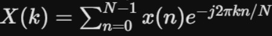
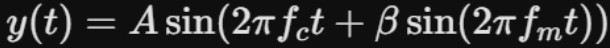
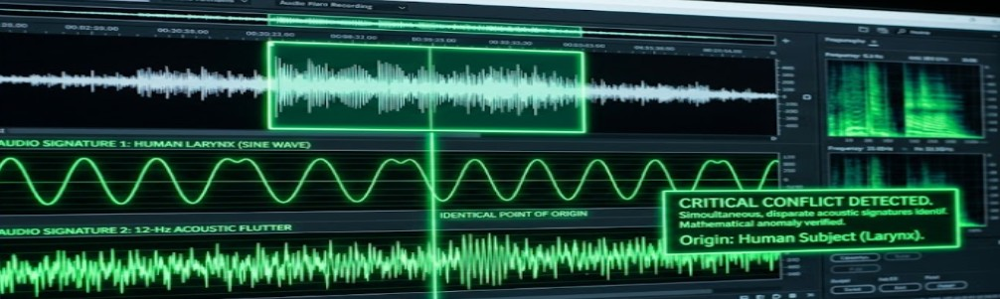

**Chapter 3: Amuse-bouche**
---
The Hawaiian night was suffocatingly quiet, the kind of heavy, humid stillness that felt less like peace and more like a held breath. At 3:14 AM, perched on the jagged volcanic ridge overlooking the Woo estate, Elias Thorne was drinking room-temperature black coffee and watching a man’s ego die in real time.

Elias’s setup was minimalist, but ruthlessly efficient. He knelt on a waterproof tactical mat, shielded by a camouflage netting that absorbed the ambient moonlight. He slides his hand onto Rolo’s, a warlock European black and tan Doberman, massive shoulders, who lays beside him. The dog’s sleek black-and-rust coat blended perfectly into the volcanic rock, his cropped ears occasionally pivoting to track the distant crash of the Pacific waves. Rolo wasn't just a companion; he was a biological anomaly detector, a living baseline that Elias trusted far more than any circuit board.

Elias returned his attention to his weatherproof laptop. A directional laser-acoustic microphone was mounted on a tripod beside him, its invisible beam perfectly calibrated to read the micro-vibrations bouncing off the master suite's reinforced glass. On the left side of his monitor, a hijacked feed of Arthur Woo’s biometric smartwatch pulsed in a steady, digital green.

He expected to see the vitals of a man under extreme physical duress. In Elias’s line of work, black-bag extractions, corporate extortion, psychological operations, and of course, breaking a target all required a spiked heart rate, elevated blood pressure, and a localized flood of cortisol. Fight-or-flight was the standard mammalian baseline. You push the brain into a panic state, and the target hands over the loot.

But when he looked at the telemetry data streaming from Arthur’s wrist, Elias frowned. The data didn't make sense. Instead of spiking, the biometrics were leveling into absolute, terrifying submission. Arthur’s heart rate was dropping into the low fifties. His blood pressure was plummeting.

Through his noise-canceling headphones, Elias listened to the pristine audio captured by the laser mic. He heard the sloshing of water as Arthur exited the deep, luxurious jetted tub. He heard the soft, heavy rustle of a high-thread-count robe being draped over the old man’s frail shoulders.

Then, Yeongon’s voice cut through the audio feed. It wasn't a threat, or a demand. It was shockingly gentle, carrying a melodic, maternal cadence that made the hairs on Elias’s arms on end and shiver to follow down his spine.
“You didn't build an empire, Woo Arjun,” Yeongon murmured, using his birth name—the name he had buried decades ago. “You built a slaughterhouse and you are so very tired of pretending you don't smell the blood.”

Elias leaned closer to the monitor, as if to hear and see better. Arjun. He thought as he noted that she had bypassed the corporate persona entirely, striking directly at the foundation of his identity. Elias double-checked the biometric feed again, still not panicking. It was almost like his prefrontal cortex was effectively powering down. Elias watched the data render a catastrophic shift in Arthur’s neurochemistry. The dominant Beta waves of a paranoid billionaire were dissolving, replaced by the slow, hypnotic theta waves of a mind surrendering its last line of defense.

“I’m sorry,” Arthur’s wet voice cracked in a sudden lament.

Elias adjusted the gain on his headphones as the sound was pathetic. It lacked any of the gravelly, ruthless authority that the telecom patriarch was famous for. It was a hollow, echoing sound; The structural collapse of a decade of nagging guilt crumbling under its own weight.

“I took so much,” Arthur wept, the sound of his bare feet shuffling against the teakwood floor. “I stripped the pensions. I watched them lose their homes, and I just bought another yacht. It was never enough. And now… I have nothing of worth.”

“I know, darling,” Yeongon whispered, the sound of a hand gently stroking wet hair coming through the feed. “But now, you have me...”

Then Elias heard the whistle that made his skin crawl and his teeth grind, it made him dig his chewed down fingernails into the beds of his palms. It started as a clean, piercing high note, dropped a major third, and dragged out into a low, buzzing resonance that bypassed Elias’s eardrums and vibrated directly in his molars. It sounded like a wet willow reed vibrating inside an empty brass pipe and it felt like to him that the sound was traveling around his skull, almost seeking something. 

The moment the sound ended, Arthur Woo’s biometric readouts shifted violently. His heart rate steadied into an unnaturally rhythmic forty beats per minute, breathing shallow, and the data read resembled a deep, chemically induced coma, but Elias knew the old man was wide awake. “The ego had been surgically excised.” Elias said under an expelled long breath, dropping the grueling anticipation like a physical weight. 

Elias hit a keystroke, immediately clipping the audio file. Extortion could be a police matter. A psychoacoustic weapon that could induce instantaneous neurological compliance, nowThat was intelligence gold. Jin Woo was paying him to push out a gold digger, but Elias' eyes were money signs, as he imagines that he might have just recorded a military-grade cognitive override.

Elias pulled the clipped audio file into his advanced spectrum analyzer software, intending to isolate the frequency, his leg bounced under him in an exciting anticipation. Rolo looked to him a moment before returning his visual hunt of the villa. Elias expected to find the digital signature of a concealed transducer, a bone-conduction emitter, or a high-end parabolic speaker hidden in the suite.

Instead, the waveform rendered on his screen, and Elias stopped breathing. He stared at the bright green graphical interface, his cynical, data-driven mind stalling out against a mathematical impossibility.

He ran a Fast Fourier Transform (FFT) on the audio clip to decompose the sound into its constituent frequencies:

The output was utterly flawless, and biologically terrifying.

_Audio Signature 1: A clean, sustained sine wave hovering near 698 Hz, originating directly from a human larynx._

_Audio Signature 2: A simultaneous, rapidly fluctuating 12-Hertz acoustic flutter._

Elias highlighted the intersection of the waves. The conflict was undeniable. Both sound waves shared the exact, identical point of physical origin. To achieve this kind of dual-tone frequency modulation, the acoustic physics would require an equation resembling:

Where the carrier frequency _(fc)_ and the modulating frequency _(fm)_  operate independently.

Elias leaned back in his folding tactical chair, his training warring with his fundamental grasp of anatomy. Humans possess one set of vocal cords. It is physically, anatomically impossible for a mammal to produce a clean sine wave and a mechanized, dual-tone vibration simultaneously without a synthetic voice box, a concealed electronic modulator, or a secondary, independent throat architecture.

But the spectrum analyzer proved the sound was completely organic. There was no electronic distortion, no digital artifacts and the sound was coming out of her mouth. Elias tapped his calloused fingers against the cold magnesium chassis of his laptop. “Reverse engineer the logic,” he told himself, staring at the green spikes on the monitor. “If the hardware producing the sound isn't human... then the woman running the hardware isn't either.”

A cold, unfamiliar sensation settled low in Elias’s gut, his arm hairs tried to stand on end under the restrictive tactical suit. He wasn't tracking a con artist; He was tracking an apex predator wearing a tailored silk suit.

He reached for his encrypted satellite phone and rang Jin Woo. He needed to advise his arrogant, sociopathic client that they were no longer dealing with a hostile corporate takeover, but a containment scenario. As he hit send, Rolo suddenly shifted.

The Doberman didn't bark. He didn't growl. But the dog’s hackles rose in a stiff, razor-sharp ridge straight down his spine, and he let out a low, barely audible whine, pressing his heavy body flat against the volcanic rock.

A sharp burst of static crackled through Elias’s headphones. Elias froze a moment then glanced over to his laser mic feed. The ambient sound in the master suite—the distant crash of the ocean waves against the cliffs, the hum of the air conditioning, Arthur’s shallow, comatose breathing—had all gone dead silent. The audio was unnaturally clean. It sounded as if the laser microphone had suddenly been sucked into an absolute, pressurized vacuum.

On his monitor, the thermal camera feed of the bedroom shifted. The glowing, orange-red heat signature of Yeongon stood up from the edge of the teakwood bed. Elias watched her thermal outline move. She didn't walk to the window. She flowed. Her movements were frictionless, coiled, and entirely devoid of the micro-hesitations that governed human biomechanics. It was the terrifying, fluid grace of a serpent sliding over glass. She stopped exactly two inches from the reinforced pane.
Elias was a mile and a half away. He was shrouded in absolute darkness, wearing matte-black gear, utilizing invisible laser telemetry, entirely off the grid. There was zero operational probability she could see him. That would defy optics AND physics.

Yet, through the thermal lens, he watched the glowing silhouette tilt her head precisely, aligning her gaze perfectly with his exact GPS coordinates on the ridge. Like she was staring at him.

A low, resonant whisper bypassed the reinforced glass and the mile and a half of dense, tropical night air and slid directly into the encrypted audio feed of his headphones with a terrifying, heavy clarity that vibrated against his skull. “Your heart is beating at ninety-five beats per minute, Elias. You are too tense, yet you’re not on my list yet.”
Elias ripped the headphones off his ears, the thick cord snapping violently against the laptop keyboard. The threat rang in his ears as if the sentence now lived in his head.

The heavy, humid silence of the Hawaiian ridge crashed back down on him, deafening after the invasive clarity of her voice. Beside him, Rolo was baring his teeth at the distant villa, trembling slightly. Elias stared at the glowing green waveform still rendering on his screen. His pulse was hammering against his ribs, clocking exactly ninety-five beats per minute.

“Elias?” “HE-LLOO?!” “Major Tom? Can you hear me Major Tom?” Jin said through the phone, that Elias forgot he had dialed when his brain was hijacked from something not of this world, as if he’d been saying his name for hours. He reached down exhaustedly, mechanically and hung up the call, silencing the noise from the other end. He had come to this island to observe what he thought was a parasite. What he found was the abyss.

