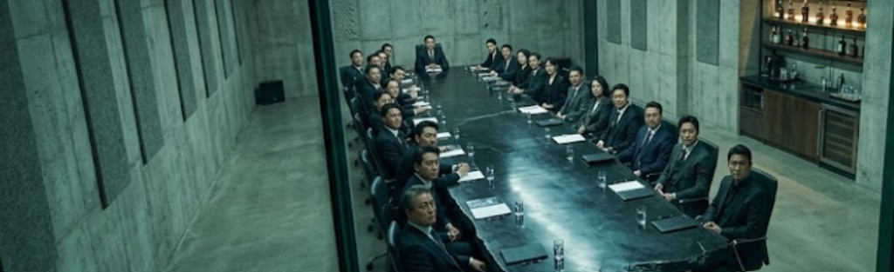

**Chapter 5: Foie Gras**
---

The Woo Telecom Vault was not designed for comfort; it was designed for paranoia. Buried four stories beneath the Seoul financial district, the boardroom was a brutalist masterpiece of poured concrete, sound-dampening acoustic paneling, and a massive, single-slab obsidian conference table. It was a Faraday cage with a wet bar.

From the observation deck hidden behind two inches of one-way ballistic glass, Jin Woo adjusted the cuffs of his tailored suit. He looked down at the fifty men and women taking their seats. They were the apex predators of the Asian markets—hedge fund managers who shorted currencies into oblivion, tech oligarchs who sold biometric data to despots, and politicians who rubber-stamped the environmental ruin of entire coastlines.

"Is the acoustic countermeasure primed?" Jin asked, not taking his eyes off the heavy steel double doors at the end of the room.

Elias Thorne sat at a terminal outside the room, his fingers flying across a backlit keyboard. "Phase-canceling audio arrays are locked. The second her vocal cords attempt to emit that dual-frequency anomaly, the room's speakers will flood the exact opposite waveform. It will flatline her sound into static. She’ll just be a woman opening her mouth."

"And the exits?" Jin asked, standing and moving to the other side of the glass entrance overlooking the room.

"Magnetic locks engage the moment you hit that button," Elias confirmed, tapping a final key. "It takes a retinal scan from you to open them. She's walking into a vacuum."

Jin looked back into the room and nodded with cold satisfaction.

In the vault, the low murmur of impatient billionaires echoed off the concrete. They were irritated by the sudden change in venue and deeply suspicious of Arthur Woo’s abrupt retirement and they were waiting for blood.

The heavy steel doors hissed open. The room went dead silent as Yeongon stepped into the vault. She did not look like a grieving widow. She wore a structural, floor-length coat of midnight-black wool. The silhouette was severe, the collar jutting up past her jawline like a dorsal fin. Instead of a fabric belt, the coat was held shut across her ribs by a series of heavy, interlocking tungsten clasps that looked unnervingly like a metal ribcage.

"Gentlemen. Ladies," Yeongon said, her voice perfectly human, smooth, and chillingly calm. She glided toward the head of the obsidian table. "My husband sends his regrets. He has decided to prioritize his... soul." Her voice momentarily dripped with venom.

A few of the board members scoffed. A telecom magnate at the far end of the table leaned back, lighting a thick cigar. "We don't care about Arthur's soul, sweetheart. We care about the Q3 projections. Where is the boy? Where's Jin?"
Others murmured and nodded in aggressive agreement.

Yeongon didn't answer. She simply reached out with one pale, flawless hand and pressed a physical button on the table’s console.

Behind the glass, Elias’s monitors instantly flashed red. "Jin," he said, his voice tightening with sudden alarm. "The magnetic locks just engaged."

"I know," Jin said coldly. "I just hit the button."

"She did it first!" Elias snapped, his hands moving frantically over the terminal. "The command didn't come from here. She locked them from the inside."

“That’s impossib—” Jin started, his voice suddenly tinged with a deep, knowing defeat that his executive functioning hadn't fully processed yet.

Yeongon turned her back to the fifty elites. She walked slowly toward the one-way glass. She couldn't see Jin or Elias through the ballistic mirror, but she stopped exactly where Jin was standing on the other side, looking directly into his eyes.

She smiled. It was a terrifying, hollow expression that didn't reach her lightless, bottomless eyes. She opened her mouth, her jaw unhinging just a fraction of an inch too wide, and she let out the liting, three-note whistle.

_Fffff... Ddddd... Aaaaa..._

"Hit it!" Jin yelled back to Elias.

Elias slammed the enter key. From the four corners of the vault, massive directional speakers blasted a highly calibrated, phase-canceling static. The room violently vibrated. The acoustic countermeasure hit Yeongon’s whistle with surgical precision, drowning out the 12-Hertz flutter before it could bounce off the concrete walls.

The whistle died. The room was filled only with a low, oppressive, deafening hum of white noise.

Elias let out a breath he didn't realize he was holding. "Got her."

But Yeongon wasn't panicking; Her smile only deepened. She reached up to her collarbone to unfasten the top clasp except that a portion burst forth, breaking and ricocheted off a wall and hid itself under the boardroom table.

A telecom executive near the front of the table suddenly gasped, dropping his tablet. He clutched his chest, his eyes going wide with sudden, inexplicable terror. "The... the lithium mines," he choked out, his voice cracking under immense psychological weight. "The water... It's all poison. So many people died from the water!"

Across the table, a ruthless hedge fund manager collapsed out of his chair, weeping hysterically and clawing at his own throat. "I took it all. I took their homes. God, why did I take them? I didn’t need any more homes!!"

Behind the glass, Elias watched in horror as the room devolved into absolute psychological chaos. "What's happening? The audio is neutralized! The countermeasure is working! Why are they all freaking out?!"

Jin beat his fists on the ballistic glass in sheer frustration, unheard by the occupants. Elias had never been bested in the field; this was an entirely new, suffocating feeling for the contractor. His stoic face distorted as the dam of his own logic broke. Elias stood in horror and awe next to Jin, watching the architecture of fifty corporate empires collapse.

Yeongon unfastened the second clasp. The black wool parted slightly, revealing a flash of iridescent, oil-slick scales beneath the fabric. The ambient temperature in the room skyrocketed. She lifted her arms like an angel about to take flight, taking a deep, shuddering breath in as their shattered souls filled her chest. She nearly had a hard time composing her fragile human form as she consumed all the dense, corrupted mass at once.

A pleasured and satisfied guttural moan escaped her pale lips as each of the fifty board members began to contemplate their own deserved deaths. The telecom magnate threw himself at the glass doors where Jin and Elias stood. He bashed his forehead against the impenetrable barrier, staining it crimson with his desperate attempts. His nose crushed under the constant, rhythmic bashing, embedding the frames of his expensive glasses deep into his own face.

The exit glass was slathered in thick red smears before the magnetic doors finally slid open, releasing the pressurized heat of the room with a pneumatic hiss as heavily armed corporate security marched through to restrain the bleeding man.
The absolute silence of the vault was instantly shattered by chaos. Corporate assistants sprinted into the carnage, screaming as they found their CEOs weeping on the floor or bleeding out against the glass. Within minutes, the vault was swarming with paramedics, stretchers, and confused police.

Amidst the frantic flashing of EMT penlights and shouting medics, Yeongon pressed herself against the cold concrete wall, brilliantly shrinking her posture to look small and fragile. She pulled the heavy tungsten clasps of her midnight-black coat tight, trembling just enough to mimic severe psychological shock. A paramedic rushed to her side, gently draping a foil emergency blanket over her shoulders and asking softly if she was hurt.

She offered a slow, trembling nod, letting the man treat the dragon like a piece of shattered glass—even as beneath the crinkling foil blanket, her pulse was a steady, cold sixty beats per minute. As the paramedic carefully guided her through the sea of broken billionaires, Yeongon allowed herself a moment of quiet, predatory respect. _Jin and Elias did well,_ she thought, savoring the heavy, dark energy settling warmly in her chest. _A psychoacoustic deprivation chamber to amplify my foci. I hadn't considered that._

They had tried to build a cage, and instead, they had built her a pressure cooker that forced the prey to baste in their own terror. Just before the paramedic led her out through the heavy steel doors, Yeongon paused. She turned her head slightly toward the one-way ballistic mirror. For a fraction of a second, the traumatized widow vanished entirely. A wicked, razor-sharp smile curled across her pale lips, meant exclusively for the two men she knew were standing paralyzed on the other side of the glass.

Looking dead into the center of the mirror, she mouthed the words with perfect, deliberate articulation so Elias and Jin could read the exact shape of her teeth.

_I didn't need the sound. You gave me the silence._

As the heavy doors closed behind her, Jin Woo slumped back against the console, his breathing shallow. The absolute supremacy of his ego had just been violently excised, leaving a massive, echoing psychological void in his mind.
For Jin the observation deck went eerily quiet and the air pressure in the room suddenly dropped, Elias, the boardroom and the police all disappeared. 

A low, vibrating click echoed from the shadows of the ceiling directly above Jin's head. Jin didn't move as he felt a sharp, sudden coldness radiate down the back of his neck, smelling faintly of old earth and ozone.

Detaching itself from the acoustic ceiling tiles was a shape that completely defied the sterile, corporate cleanliness of the room. It was the size of a large dog, suspended upside-down by eight impossibly long, spindly legs that moved with frictionless, liquid silence. Its central body was encased in glossy, obsidian chitin, naturally sculpted by some ancient evolutionary nightmare into the exact silhouette of a severed wolf's head with tall, neon orange jagged rabbit ears. Jin couldn’t force himself to move but he didn’t feel like he was in any danger either.

It didn't fall. It simply lowered itself down the wall, stopping just inches above Jin’s shoulder. Two large, false yellow eyes—luminescent and devoid of pupils—glowed menacingly from the creature's back. It leaned its grotesque, chitinous head forward and opened a small, mandible. _Quite cute in the creepiest way_ Jin thought. And with a sharp hiss, it inhaled a wisp of the residual, static terror radiating off Jin’s tailored suit.

Jin had spent his time traveling the world and getting beaten by it, but he was always listening, learning and watching. This has to be a scavenger, what the locals in Ecuador might call an Opiliones. Shepherds to agriculture in mythology and most likely this large is drawn to the psychic blood in the water, it had found the largest, quietest vacuum in the building: Jin Woo’s newly hollowed mind. The Bunny Harvestman clicked softly, its false yellow eyes locking onto the side of Jin’s face. It was home and it was willing.

