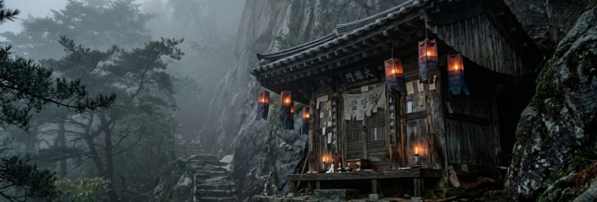

**Chapter 6: Afterdinner Mint and the Mountain**
---
The penthouse above the Seoul financial district was a monument to absolute minimalism, wrapped in black marble, brushed steel, and floor-to-ceiling glass. It was designed to be a sensory deprivation chamber for the ultra-wealthy—a place of total, expensive silence.

Right now, to Yeongon, it was deafening. She stood in the center of the dark living room, her breath coming in shallow, ragged rasps that sounded like a cracked engine manifold, ‘this human suit’ was failing. Consuming Arthur Woo had been a refreshing drink; inhaling fifty apex predators at once was like swallowing an entire dessert cart in one bite.

Fifty-one egos were currently screaming inside her head, violently thrashing against the confines of her constructed consciousness. These were not the souls of compliant prey. They were billionaires, fixers, and oligarchs—men and women whose entire neural architecture was built on dominance, arrogance, and control. And now, they were trapped together in the boiling, claustrophobic dark of her celestial digestive tract.

She could feel the specific textures of their panic. She felt CEO Han’s pathetic, scrambling terror as his stock portfolios burned in his mind. She felt the indignation of a shipping magnate who still couldn't comprehend that his wealth couldn't buy him out of hell. Their collective cognitive dissonance was generating a massive localized spike in her core temperature.
The air in the penthouse warped. The ambient temperature spiked from a cool sixty-eight degrees to over one hundred and ten in a matter of seconds. The condensation on the floor-to-ceiling windows instantly flashed into steam.

Yeongon was seeing fractured, overlapping colors—violent bursts of ultraviolet and infrared bleeding into the visible spectrum as her optic nerves short-circuited. The room spun on a tilted axis. She let out a manic, breathless laugh, which abruptly choked into a wet sniffle. She screamed, clutching her chest as a sharp, agonizing pressure built behind her sternum.

She dropped to her knees, the impact cracking the polished black marble beneath her with the force of a falling anvil. Her midnight-black coat was no longer just a garment; it was a high-pressure containment vessel, and it was reaching its holding limit. The heavy tungsten clasps running down her ribs groaned aloud. It was the terrifying, metallic sound of a submarine's hull stressing under deep-ocean pressure. The metal warped, audibly clicking as the expanding, non-human mass beneath the fabric fought to break free.

She convulsed. A sickening, wet crunch echoed through the steaming penthouse as the bones in her shoulders snapped, elongated, and violently reset themselves into a broader, reptilian form. At her collar line, where the top clasp had been undone during the chaos of the vault, her pale human skin was entirely gone.

In its place was a dense, interlocking pattern of heavy copper and obsidian scales. They didn't just look like armor; they looked like geologic formations, slick with a thick, iridescent fluid that smelled strongly of ozone and burned copper. The heat radiating off the exposed scales was enough to scorch the collar of her silk blouse into ash.

She reached up with trembling, clawed fingers—her fingernails having darkened and sharpened into dense keratin talons—and seized the top clasp. With a guttural, multi-toned snarl, she forced it shut. The lock clicked, biting brutally into the scales, compressing the celestial mass back down into the suffocating shape of a human woman.
The pain was blinding, a white-hot spike driving straight through her cerebral cortex. But she welcomed it. The pain meant the structural integrity of the suit was holding.

_Fifty-one souls down. Forty-nine left._

That thought painted a massive, toothy smile across her face. Her jaw had involuntarily unhinged a fraction of an inch, revealing rows of translucent, needle-like teeth. Copperish, iridescent blood—the byproduct of her internal biological rupture—cascaded down her teeth, spilling over her bottom lip and dripping from her chin onto the ruined marble.

She cackled. The sound was wrong, echoing like a wet willow reed played backward. She imagined the perfectly curated, arrogant faces of the celestial court when she finally breached the heavens. She wouldn't just ascend; she would tear the obsidian pillars down. She would rend their immortal blood to feed the dirt-dwelling humans below, drowning the ultimate 1% in their own extracted capital. She would be vindicated, and she would stop their extractivistic, bureaucratic machine once and for all.

Dragging her heavy, mutating limbs across the floor, she crawled toward the glass window. She pressed her burning forehead against the reinforced pane, looking down at the glittering, parasitic grid of Seoul. The beast inside her thrashed, furious at being caged, but Yeongon forced herself to keep that terrifying, blood-stained smile. She was halfway to heaven, but she has never felt so heavy.

At 4:13 AM, the air on Inwangsan Mountain tasted like pine needles, wet granite, and ozone. Elias Thorne did not belong, he was a creature of server rooms, tactical uplinks, and biometric data. He survived by reading the digital exhaust that people left behind, yet, he found himself hiking up the steep, unpaved stone steps winding into the dark peaks above Seoul. His laptop, his spectrum analyzers, and his thermal optics were at the bottom of the mountain, locked in the trunk of his rental car, Rolo as typical, by his side at a perfect heel.

Data had failed him. When Yeongon weaponized the absolute silence of the vault, she had rendered billions of dollars of corporate surveillance technology entirely obsolete. He was here for the analog code.

The ninety-nine-pound European Doberman navigated the treacherous, slick stone steps next to Elias with effortless, four-wheel-drive precision. But Rolo wasn't relaxed, his hackles were raised in a stiff ridge from the base of his skull to his docked tail. His dark nose flared constantly, pulling in the scent of ancient, unsettled energy that saturated the mountain air. Rolo was Elias’s biological anomaly detector, and right now, the dog’s autonomic nervous system was screaming that they were walking into something that was off from normality.

Through the mist, a small, weathered shrine emerged. The wide numerous steps were replaced by a thin walkway hugging a sheer wet granite wall. It certainly wasn't a tourist trap; it was built directly into the side of the rock face, anchored by timber that looked older than the city below. Faded paper lanterns, torn by the brutal mountain winds, hung from the eaves, casting a dim, flickering light across the clearing.

Beyond the death defying shimmy to the shrine, on the wooden porch, smoking a thin, unfiltered cigarette, was an old woman. She wore a traditional white hanbok, but she sat with the sprawling, unapologetic posture of a dockworker at the end of a double shift. Her eyes were milky with thick, white cataracts, but as Elias and Rolo stepped into the clearing, she stopped moving. She exhaled a long plume of blue smoke and targeted her blind eyes to where Elias stood.

"You smell like burned copper," she rasped in Korean, her voice a heavy, gravelly drag. "And terror." She coughed out her cigarette smoke.

She took another long puff, then reached down, pinching the cherry of the cigarette out with her bare fingers and dropping the butt onto the stone walkway. She turned her blind gaze slightly to the left, fixing on the massive dog.

"You brought a wolf to hunt a dragon," she noted dryly. "It is a clever idea, but is insufficient. A dog can tell you the beast is in the room, but its teeth cannot pierce the armor."

Elias stopped at the edge of the porch, commanding Rolo into a silent sit with a flick of his wrist. "I was told I could find a Mansin here. A master."

"You found an old woman who wants to sleep," she replied, leaning back against the wooden post. "Go back to your computers, American. Whatever you saw in that basement today, you don't have the hardware to fix it."

Elias didn't flinch. He didn't pull rank, he didn't flash a weapon, and he didn't offer Jin Woo’s endless offshore money. He observed the space, analyzed the structural hierarchy, and adapted his protocol. He dropped to one knee, lowering his eye level deliberately below hers—a calculated sign of submission to a superior operating system.

"I built a psychoacoustic cage to stop her," Elias said calmly, keeping his vocal baseline perfectly level. "It failed. She didn't use a frequency to break them. She used the silence to force them to look at their own rot. The lack of sensory input amplified their guilt until their egos collapsed under the pressure."

The old woman tilted her head, listening to his strange, clinical terminology.

"She has fifty-one souls," Elias continued. "And a man named Jin Woo is going to die if I don't figure out her weaknesses."
The Mansin stopped leaning against the post. The casual, dismissive arrogance dropped from her posture entirely. "Fifty-one?" she whispered, the number carrying a sudden, terrifying weight. "The Yeongno is halfway there."

"So, Jin was right," Elias whispered, half to himself, confirming the mythological parameters of the engagement.

"My bloodline has guarded the celestial goings-on for four hundred years," the Mansin said, standing up. She wasn't frail. The arthritis in her hands was a lie; she moved with a sudden, coiled, predatory intensity. "She is not a demon, boy. She is a celestial auditor. An apex predator that fell from the sky because she pointed out that the heavens are just as corrupt as the earth."

“The Yeongno…” Elias frowned, his analytical mind chewing on the data, stripping away the poetry to find the mechanics. "If she's an auditor, a punisher of the corrupt, why would you want to stop her? Let her eat the billionaires. It balances the spreadsheet, less demons and angry spirits, right?"

"Because if she reaches one hundred, she doesn't just go back to heaven. She razes the earth to get there. Her ascension will break the skies, and the fallout will crush the innocent along with the guilty. The skies will turn to blood and fall endlessly upon the land" The old woman turned and walked into the dark, incense-choked interior of the shrine. "Come inside, Server-Dweller. It is time you learned how to code in cinnabar."

Elias stood up and motioned for Rolo, who stayed glued to his side as they stepped into the cramped, windowless room. The air was heavy, thick with the smell of old paper, burning mugwort, and damp earth.

The Mansin walked over to a heavy, iron-bound wooden chest. She unlocked it with a heavy brass key and pulled out two items, setting them deliberately on the low wooden table between them.

The first was a small, heavy brass mirror—a Myeongdu. Its surface was distinctly convex and polished to a blinding, flawless shine, despite looking centuries old. The second was a solid block of deep red paste, resting beside a calligraphy brush made of stiff animal hair.

"A Myeongdu mirror," she said, tapping the cold brass with a long brittle seeming fingernail. Rolo growls gently at the energy emanating from the spiritual objects as she explains. "It reflects the divine light. If you catch her reflection in this, the camouflage of her human suit becomes transparent. You will not see the woman, but instead you will see the truth of the beast underneath."

She moved her finger to the red paste. "Cinnabar. The blood of the earth. You cannot shoot a spirit, Elias Thorne. You cannot blow it up with C4 or track it with a thermal scope. You must seal it. You must write the Bujeok—the sealing script—and you must physically apply it to the entity’s vessel."

Elias looked at the primitive tools. His mind immediately raced backward, reverse-engineering the analog logic and mapping it onto his understanding of physics. The tungsten clasps on her coat, Elias thought. They weren't just fashion accessories. They were mechanical fail-safes. They were the load-bearing bolts keeping her expanding, celestial mass contained within the localized pressure of a human silhouette.

"If I break the clasps," Elias muttered, staring at the red ink, piecing the puzzle together aloud. "Her physical mass expands faster than the thermodynamics of her human suit can handle. It triggers a biological meltdown. And if I apply this script to the broken locks..."

"You trap her inside her own collapsing body," the Mansin finished, a grim, terrifying smile cracking her weathered face. She understood exactly how he was translating her magic. "You use her own expanding mass to crush her. The script acts as an impenetrable barrier. The pressure builds, but the cage does not yield."

She leaned over the table, her blind eyes seeming to bore directly into his prefrontal cortex. "But you must get close enough to paint the seals, and you must do it perfectly. The geometry of the stroke must be flawless. One mistake, one tremor in your hand, and she will eat your ego while you are still using it."

Elias picked up the brass mirror. He felt the heavy, cold, kinetic weight of the ancient metal in his calloused hand. He was a man who lived and died by microchips, fiber optics, and digital distance. But as he looked at his own distorted, shadowed reflection in the curved brass, he realized the rules of engagement had permanently changed. He couldn't snipe her from a mile away. He was going to have to get into the ring with a god, and he was going to have to get his hands dirty.

"Teach me, Master," Elias said.

