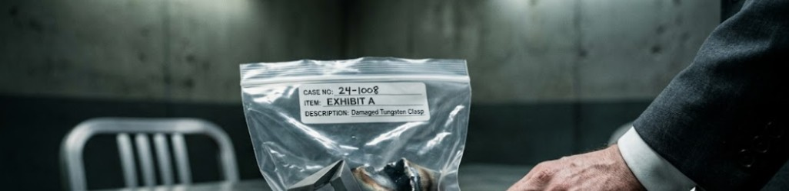

**Chapter 7: The Digestif**
---
The interrogation room at the Seoul Metropolitan Police Agency smelled like stale coffee, ozone, and bureaucratic panic. Jin Woo sat perfectly still in a bolted metal chair, having surrendered his encrypted phone at the door. His tailored jacket was neatly folded over his lap, and his resting heart rate sat at a cool, sociopathic sixty-five beats per minute. He did not look like a man who had just watched a supernatural entity consume half the Asian markets’ GDP in a single bite, but like a CFO managing a hostile PR crisis.

Detective Park, a weary twenty-year veteran with deep, bruised bags under his eyes, tossed a thick manila folder onto the scratched aluminum table. "Fifty-one people, Mr. Woo," Park said, his voice flat with exhaustion, devoid of any interrogator's theatrics. "Fifty of the most powerful executives in the hemisphere lock themselves in your subterranean vault. Twenty minutes later, the magnetic seals disengage and we walk into a room filled with billionaires weeping on the floor, confessing to wire fraud and environmental crimes. And…” Park sighed heavily, dragging a calloused hand over his face. “...CEO Han of Daejung Heavy Industries has bludgeoned his own skull against a piece of ballistic glass until he nearly expired."

Park leaned forward, resting his knuckles heavily on the table. "I have twenty-two corporate lawyers in the lobby right now threatening to sue the city, the precinct, and me personally. I need an explanation. Now."

Jin met the detective’s eyes with practiced, hollow empathy. "It was an acoustic environmental failure, Detective," Jin said smoothly. He reached into his breast pocket and slid a folded technical schematic across the table. "My grandfather built that vault to be a Faraday cage to prevent corporate espionage. To ensure absolute privacy, it was fitted with a high-end phase-canceling audio array. White noise."

Jin let out a perfectly timed, heavy sigh, shaking his head slightly. "The system malfunctioned. It locked the doors and blasted a localized, high-decibel, low-frequency oscillation. Do you know what happens to the human brain when you trap fifty high-stress, sleep-deprived executives in a sealed, windowless room and subject them to extreme sensory deprivation and weaponized infrasound?"

Park stared at the schematic, his eyes scanning the complex wiring diagrams Jin had hastily pulled from the server archives before arriving. "Mass psychogenic illness," the detective muttered.

"A collective psychotic break," Jin corrected gently. "Han was already under SEC investigation. The sensory deprivation triggered a severe panic attack. He hallucinated, panicked, and tried to break the glass. It is a profound…” He paused for theatrics, “...unavoidable tragedy. The Woo family will, of course, fully cooperate with any and all investigations and provide a comprehensive financial settlement to CEO Han's estate."

Jin watched the tension slowly begin to leave the detective’s shoulders. The police didn't want a mythological mystery; they wanted a liability form they could file and send to the insurance companies. Jin had just handed them a neat, data-driven excuse that blamed bad wiring instead of magic.

"That explains the madness, Mr. Woo," Park said quietly. He didn't open the folder. Instead, he reached into his coat pocket and placed a clear plastic evidence bag on top of the schematics. "But it doesn't explain this."

Jin’s eyes dropped to the bag. Inside sat a heavy, dark piece of metal. It was a thick, geometric clasp. Jin recognized it immediately. It was one of the interlocking tungsten fasteners from the front of Yeongon’s midnight-black coat.

"My forensics team swept the floor of the vault," Park continued, his tired eyes locking onto Jin’s face, searching for a micro-expression. "They found this under the head of the table. It’s tungsten. But look at the shear point."

Jin leaned closer, his analytical mind engaging. The thick metal hadn't been cut or smashed. It was warped outward, the dense molecular structure bent and sheared as if it had exploded from the inside.

"Tungsten has the highest melting point of all metals in pure form," Park noted, tapping the plastic bag. "Over six thousand degrees Fahrenheit. Forensics says this clasp was exposed to an instantaneous, localized thermal spike exceeding three thousand degrees, combined with immense hydrostatic pressure. In a climate-controlled room. The heat signature scorched a perfect circle into your concrete floor."

Jin stared at the broken metal. The floor of his reality completely shifted, but his heart rate didn't spike. Instead, a cold, crystalline clarity washed over his prefrontal cortex.

_She broke._ Jin thought to himself. Jin reverse-engineered the physics in a fraction of a second. She had inhaled fifty apex predators at once. The corrupted energy had generated a catastrophic thermal spike inside her body. The human suit wasn't just a disguise, it’s a pressure vessel. She couldn't vent the heat fast enough, and the physical expansion of her true form had literally blown the locks off her coat.

She overheats. She has a thermodynamic limit.

Jin looked up from the bag, his face a mask of mild, polite confusion. "I have no idea what that is, Detective. Given the heat signature, I can only assume CEO Han or one of the others smuggled in an encrypted recording device with an experimental lithium-ion battery. Under the acoustic pressure, the battery must have suffered a catastrophic thermal runaway and exploded. I highly recommend your team check the remaining debris for silicon."

Park stared at Jin for a long time. The detective knew it was a lie, but it was a lie wrapped in impenetrable corporate logic, and it gave him an out. "And your grandfather's new wife?" Park asked, slowly pulling the evidence bag back across the table. "She was in the room."

"A young woman, entirely out of her depth, trapped in a room with fifty screaming men," Jin replied, his voice chillingly deadpan. "She is currently under heavy sedation at the penthouse with Arthur Woo. I ask that you give her time to recover from the trauma."

Park stood up. He tossed Jin’s encrypted phone onto the table. "Don't leave the city, Mr. Woo."

As soon as the interrogation room door clicked shut, Jin grabbed his phone. He bypassed the lock screen and opened a secure, encrypted channel to Elias Thorne.

He sent a short few sentences to inform Elias: The suit is a pressure cooker. When she eats, she releases heat. If we trap her and accelerate the ambient temperature, her biological containment will fail.

Two hours later, Jin sat in the pitch-black living room of an anonymous, high-end hotel suite on the edge of the Han River. He hadn't turned on the lights. He simply sat in a leather armchair, staring at the faint neon glow bleeding through the window blinds.

His corporate ego had been entirely shattered in the subterranean vault. To survive her psychoacoustic pressure, Jin had essentially initiated a localized lobotomy on his own arrogance, creating a massive, echoing vacuum in his neuropsychology.
Nature abhors a vacuum.

The ambient temperature in the hotel room suddenly dropped. From the corner of the room, a minor Gwisin manifested. It was a pathetic, shivering mass of gray static—a parasitic bottom-feeder drawn to the residual, high-octane trauma still clinging to Jin's tailored jacket. The ghost crawled across the carpet, its jagged, shadowy fingers reaching for Jin’s ankle to siphon the cortisol from his blood.

Before the spirit could touch him, the shadows on the ceiling directly above Jin seemed to physically detach.
A massive, pitch-black mass dropped silently onto the floor between Jin and the Gwisin. It was the size of a large dog, suspended on eight impossibly long, spindly limbs. Its body resembled a grotesque, severed black wolf's head mashed with the silhouette of a rabbit, crowned with two glowing, false yellow eyes designed by evolution to terrify predators. It resembled a Bunny Harvestman. Jin’s smartwatch faintly illuminated his wrist. 65 BPM and he didn't move a muscle.

The arachnid lunged with terrifying, frictionless speed. It didn't bite the Gwisin; it simply engulfed it. The ghost dissolved into a sharp, ozone-scented hiss as the Harvestman violently metabolized the static.
The massive arachnid turned, its false, glowing yellow eyes locking onto Jin. It didn't attack, instead it vibrated with a low, clicking hum that Jin felt in his molars, then seamlessly skittered up the wall, retreating into the dark corner of the ceiling. It hung perfectly still, watching the door.

Jin analyzed the data. When he destroyed his own ego, he created empty neural real estate. This thing wasn't a guardian angel; it was a symbiotic squatter. It ate the bottom-feeders, and in exchange, Jin provided the quiet, predator-free environment of his newly sociopathic mind. It was a perfect, analog security system.

Jin leaned back in his leather chair, his eyes fixed on the massive shadow clinging to the ceiling. "Rent is due on the first," Jin whispered to the dark.

High above the city, in the minimalist void of the Woo penthouse, Yeongon was not sedated. She was adapting. The violent thrashing inside her neural architecture had finally slowed to a low, rhythmic hum. The fifty-one egos had been metabolized, slowly digested by the ancient celestial engine burning in her chest. The ambient temperature of the penthouse, which had spiked to over one hundred degrees during her breakdown, was finally cooling. The steam on the floor-to-ceiling glass was condensing into heavy drops of water.

She stood up from the cracked marble floor and her movement was slow, highly deliberate, testing the load-bearing capacity of her joints. Her shoulders, which had violently broken and reset into her true form an hour ago, were perfectly aligned back into their disguise. The blinding pain was gone, replaced by a terrifying, absolute clarity.

She walked toward the floor-to-ceiling mirror in the foyer. She passed the master bedroom, where Arthur Woo lay comatose in a hospital bed. He had fallen into a deep, hollow depression, his ego entirely excised, kept compliant and silent with intravenous Midazolam administered by his new, devoted wife. He was her anchor, the legal shield that kept the authorities at bay.

The human suit had re-stabilized, but the internal pressure had fundamentally altered its density. Before, she had moved with a light, frictionless grace. Now, there was a visible, heavy gravity to her steps. The marble seemed to groan slightly under her bare feet. The midnight-black wool of her coat hung perfectly straight. The remaining heavy tungsten clasps across her ribs were locked tight, no longer warping under the strain.

She looked at her reflection. Her pale skin was flawless, but her eyes had permanently changed. The whites of her eyes had taken on a faint, iridescent coppery, oil-slick sheen in the dim light—the subtle, unmistakable shimmer of a dragon’s scale.

She raised a hand and dragged her cool fingertips across the glass of the mirror. She didn't just feel the energy of the fifty men she had consumed; she felt their souls, their memories, their emotions. Residual memories whispered in the back of her mind like a synchronized radio broadcast, as she saw the cryptographic passwords to Cayman Island offshore accounts. She felt the exact bureaucratic loopholes used to ruin coastlines in the South China Sea, as well as tasted the arrogant sneers of a hundred boardroom coups.

It was a heavy, toxic sludge of human corruption, but to a celestial auditor, it was high-octane fuel. Yeongon let out a long, slow breath; the sound was entirely, perfectly human. She closed her eyes, re-centering her posture, locking her spine into a rigid, immaculate line.

She had survived the mass acquisition. The physical formwork had held. Now, armed with the liquid assets of fifty empires and the digitized secrets of the Asian markets, she no longer needed to hide behind a marriage. She was no longer just a myth; she was the apex predator of the global boardroom.

Forty-nine souls left before the Gods’ judgment day, she reminded herself, opening her dark, lightless eyes.

