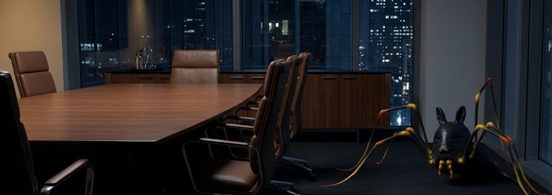

**Chapter 9: Sourcing Ingredients**
---
The Woo Telecom boardroom was a masterclass in psychological warfare, designed by architects who understood that intimidation is a structural calculation. Suspended sixty stories above Seoul, the room was encased entirely in heavy, acoustic-rated, double-paned ballistic glass. It drowned out the chaotic, neon-lit hum of the city below, effectively trapping and magnifying the heavy, tense silence inside. The localized HVAC diffusers breathed a steady, sterile stream of sixty-eight-degree air over the room, keeping the environment perpetually cold to prevent the executives from sweating through their bespoke suits.

Jin Woo sat at the head of the massive, single-slab mahogany table. To his left and right sat the surviving eight members of the executive board.

These were not the apex predators of yesterday. The true titans of Asian finance had all died weeping in Jin’s subterranean vault four months ago. These eight men and women were the opportunistic scavengers who had stepped up to fill the massive corporate vacuum. But they had all seen the coroner reports. They had all seen the closed-casket logistics. The trauma of that massacre hung in the boardroom like a localized change in barometric pressure. With Arthur Woo comatose in a hospital bed and the terrifying new Chairwoman conspicuously absent, the corporate sharks were circling the blood in the water, desperate to assert dominance before she returned to eat them too.

Director Choi, the newly minted VP of Global Logistics, steepled his manicured fingers. He possessed the sharp, hungry look of a man who firmly believed he was the smartest predator in the room. His heavy, platinum Patek Philippe watch caught the harsh glare of the recessed LED lighting.

"The optics are unsustainable, Jin," Choi said smoothly. His voice was perfectly modulated for a boardroom coup. He glanced down the length of the table, gathering the silent, complicit support of the other board members. Several of them gave microscopic nods, their eyes darting nervously toward the heavy oak doors.

"The market is terrified of the Chairwoman," Choi continued, his confidence swelling as the others fell in line behind him. "And your... erratic hotel rotations, your sudden, paranoid absence from the public eye, and the massive, untracked capital expenditures into obscure R&D labs in Busan heavily suggest you are no longer fit to hold the operational reins of this empire. The board is prepared to call a formal vote of no confidence."

Jin didn't blink. He didn't adjust his posture, nor did he defend his expenditures. His resting heart rate held at a cool, rhythmic sixty-five beats per minute. He wasn't looking at Choi. He was looking at the ceiling directly above Choi's perfectly styled hair. Hanging upside down from the perforated acoustic ceiling tiles, perfectly camouflaged in the deep, stark shadows of the recessed lighting, was his new roommate. Its glossy obsidian chitin blended seamlessly with the dark architectural lines of the ventilation ducts. Its terrifying silhouette, a grotesque fusion of a severed wolf's head and a rabbit's ears supported by eight impossibly long, spindly, shadowy legs, remained entirely motionless. Its legs were casually draped over the aluminum HVAC grates like a spider resting on a web of corporate infrastructure and its two false, glowing yellow eyes were locked dead onto Choi’s scalp.

No one else in the room could see it. They lacked the severe, mind-altering trauma required to strip away the human veil. But Jin could see it. More accurately, he didn’t need to see it, because he could also feel it. Jin’s highly analytical brain didn't categorize the beast as a mere demon; he categorized it by its taxonomy. The old European naturalists and Latin farmers had classified the mundane, earthly cousins of this creature under the order Opiliones. In antiquity, the word translated directly to ‘shepherds’. It was a darkly perfect title, he thought as Jin observed his new symbiotic parasite, he felt a profound swell of dark pride. When the massacre in the vault had shattered his ego, leaving his mind a defenseless, wandering void, he hadn't just survived the psychological lobotomy. He had acquired a celestial shepherd. And a shepherd's primary function was to protect the flock by violently culling the wolves.

The room was drowning in tension while Jin was absolute frost.

The massive arachnid vibrated against the ceiling. It emitted a low, rhythmic clicking frequency—like a Geiger counter reacting to radiation—that completely bypassed Jin’s eardrums and registered directly in the tissue of his prefrontal cortex. It was feeding him raw, unencrypted analog data, dissecting Choi’s biology in real-time.

_Heart rate elevated to 110 BPM. Blood pressure spiking against the carotid artery. Micro-perspiration forming on the upper lip and the base of the neck. Scent profile: acute cortisol, bitter adrenaline, mixed with cheap, duty-free cologne. Respiratory rate: shallow and erratic. Conclusion: He is terrified. He is bluffing. He doesn't have the votes to survive a counter-attack._

Armed with the raw biology of the room, Jin leaned forward. The leather of his chair creaked quietly as he rested his tailored elbows heavily on the polished mahogany. "A vote of no confidence," Jin murmured. His voice was a chilling deadpan that seemed to instantly strip the remaining oxygen from the room. "How democratic of you, Director Choi. Tell me, does your sudden, touching concern for corporate optics extend to the offshore accounts in Macau? The ones you’ve been funneling Woo Telecom logistics capital into for the past three years?"

Choi’s jaw locked.

"Or perhaps," Jin continued, tilting his head a fraction of an inch, "it extends to the shell company in Singapore you established under your mistress's maiden name? The one currently bleeding our shipping margins dry?"
Choi froze. The blood instantly drained from his face, leaving his skin a sickly, ashen gray. Down the length of the table, the other seven board members instinctively leaned back in their heavy leather chairs, physically distancing themselves from Choi as if he had just contracted a highly lethal, airborne virus.

Directly above him, the shepherd clicked rapidly. Its spindly, shadowy legs twitched in a grotesque, excited rhythm as it absorbed the sudden, massive spike of pure, unadulterated terror radiating from the executive's pores.

Jin felt the feedback loop hit him instantly. A rush of cold, dopaminergic satisfaction washed over his mind, hitting his nervous system like high-grade, pharmaceutical narcotics. He actively gripped the edge of the mahogany table, his knuckles turning white as he struggled not to roll his eyes back into his head and release a pleasured moan. The sheer, hydrostatic weight of holding total, biological leverage over another human being was intoxicating. He finally understood why Yeongon enjoyed her meals so much.

"I... I don't know what you're talking about," Choi stammered. The arrogant confidence entirely evaporated from his posture. His shoulders collapsed inward, his chest caving under the invisible pressure of Jin's data.

"You have exactly thirty seconds to resign," Jin stated. He didn't raise his voice. He simply slid a blank sheet of heavy, embossed Woo Telecom letterhead and a heavy tungsten pen across the polished mahogany. "If you don't, I will bypass the legal department and hand your ledger directly to the Chairwoman.” Jin said the following with a wicked chuckle underlining his words. “And I assure you, Choi, her severance packages are far more permanent than mine."

Choi stared into Jin’s hollow, sociopathic eyes, desperately searching for a bluff that wasn't there. He finally gave in and broke. His hands shook violently, his heavy platinum watch rattling loudly against the wood as he reached for the pen.

Jin leaned back in his chair with a cold, dead stare, his eyes dropping dismissively to some papers stacked within his leather-bound portfolio folder. His flock was secure, he glanced up at the shadowed ceiling to await the next taste of the aftermath.

Bunnie, as Jin starts to refer to the Opiliones as, settled back into architecture. Its rapid clicking subsided into a quiet, rhythmic purr as it returned to being a silent, invisible sentinel watching the boardroom door.

The corporate ecosystem had established a new baseline, and Jin was adapting flawlessly. He felt a massive weight lift from his shoulders, replaced by the wonderful, terrifying contentment of absolute, systemic control settling deep into his headspace.

