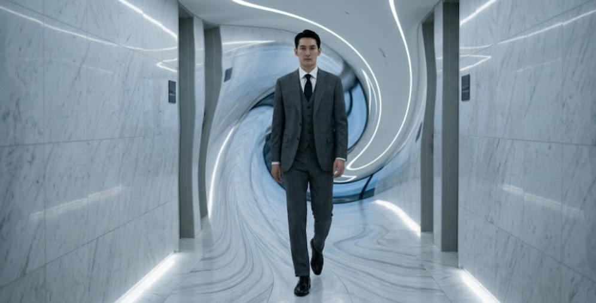

**Chapter 10: Terroir**
---

The descent to Elias' next target began behind a rusted, decommissioned utility access door in the suffocatingly loud alleyways of Namdaemun Market. Up above, the neon-soaked commercial grid was a blinding, chaotic wash of tourists, street food vendors, and localized capitalism. But the moment Elias Thorne pulled the heavy steel door shut behind him, the chaotic acoustics of the city were instantly severed. The air pressure fundamentally shifted, popping his eardrums as he descended into the subterranean architecture of Seoul’s forgotten guts.

He clicked on a low-lumen tactical flashlight. The beam cut through the thick, humid air, illuminating a steep, spiraling staircase of degrading poured concrete. The deeper he went, the more the structural integrity of the city gave way. The reinforced concrete walls were weeping with condensation above. Failing cast-iron plumbing mains, long abandoned by municipal engineers, bled hydrostatic pressure, leaving slick, foul-smelling puddles of stagnant water at the landings.

At his side, Rolo heeled with robotic like precision. The massive ninety-nine-pound European Doberman navigated the treacherous, rebar-exposed stairs with effortless 'four-wheel-drive' precision. The dog’s hackles were already raised in a low, sharp ridge. Rolo’s wet nose was working overtime, filtering out the heavy scents of mildew, sweat and raw sewage to isolate the faint, erratic pheromones of desperation and celestial static bleeding up from the dark.

At the bottom of the stairwell, Elias stepped out of the municipal corridors and into the _sumfin' illegal_, sprawling shantytown built directly into a massive, cavernous overflow plenum. This was the black market.

It was a claustrophobic labyrinth of jury-rigged infrastructure. Desperate vendors had spliced into the city’s high-voltage electrical grid, running dangerous webs of exposed copper wire across the damp ceiling to power flickering halogen work lights and humming portable generators. The air here didn't smell like the rain-washed streets above but of stale cigarette smoke, burning sage, soldering iron flux, and dried blood.

Elias kept his head down, pulling the collar of his tactical jacket up. He walked a slow, deliberate perimeter through the narrow, crowded pathways. To his left, a twitching, emaciated man with blackened fingernails was selling counterfeit yellow talismans printed on cheap, jamming laser printers. The ink wasn't cinnabar; it was synthetic toner mixed with pig’s blood, guaranteed to fail the moment a minor Gwisin looked at it.

To his right, an unlicensed shaman was violently shaking a shivering client, using a crude, magnetic tuning fork to violently scrape a low-level parasitic spirit off the man’s aura. The spirit shrieked—a high, localized burst of static—before dissolving into the damp air.

Elias wasn't here for the cheap fixes, he needed the heavy artillery. The heavy duffle that was forced over his shoulders like a back-pack faintly shuffled like paper within, when he misjudged the next paving stones elevation with respect to the others.

Finding Bora’s shop was never a matter of following a map; it was always going to be a puzzle or you've been there before. As a disgraced master, she had built her chop-shop into a blind spot in the city’s blueprints, shielding it with spatial wards that spoofed digital telemetry. Elias’s GPS had flatlined the moment he hit the bottom of the stairs. His thermal optics showed the entire Sump as one massive, illegible heat bloom. Elias holstered his scanner and looked down to his companion. "Rolo, Finden" He commanded sharply and confidently.

The Doberman let out a low huff, his cropped ears swiveling. Digital tech could be caught in a spatial loop, but a canine olfactory bulb was bound to the hard physics of chemistry. Rolo tracked the dense, coppery scent of cured earth-blood, smelled to him like the Mansin. The dog bypassed three dead-end corridors and completely ignored a reinforced steel door heavily painted with warding symbols—a decoy. Instead, Rolo stopped dead in front of a blank, load-bearing concrete wall covered in black mold. The dog stared intently at a hairline fracture in the masonry, letting out a low, vibrating and final growl.

Elias stepped up to the wall, running his calloused fingers over the cold concrete. He felt a faint, erratic draft of cold air bleeding through the microscopic fissure. The wall was an illusion—a localized manipulation of light and spatial density.

Elias, with Rolo in tow, stepped directly through the concrete.

With the illusion shattered, and Elias ducked his head to clear a rusted iron doorframe, stepping out of the damp corridor and into a cramped, subterranean chop-shop. The walls were lined floor-to-ceiling with meticulously organized shelves of cursed artifacts: heavy brass Myeongdu mirrors, sealed clay jars of grave dirt, and bundles of yellow paper that literally hummed with trapped kinetic energy.

Sitting behind a heavy, scarred steel counter was Bora. She was a disgraced former shaman, currently wearing a faded vintage band tee and chain-smoking a thin, perfectly rolled blunt. She looked up at Elias with an expression of utter, cynical exhaustion.

"I told you Americans, I don't sell wholesale," Bora rasped, blowing a thick, pungent cloud of gray smoke toward the low concrete ceiling. "Coming in here all looking the same and shit," she muttered to herself. "If you want party tricks, go to the tourist traps in Bukchon." She flicked her wrist, pointing Elias toward the door.

"Trick or Treat," Elias said. He walked up to the counter and dropped a heavy canvas duffel bag onto the steel surface. The sharp, heavy thud of dense, banded stacks of unsequential Korean Won echoed loudly in the cramped shop, the sheer weight of the capital demanding attention. "I need organic cinnabar. The real stuff. And none of  that synthetic iron oxide. It doesn’t work."

Bora stopped smoking. Her dark, intelligent eyes darted from the heavy duffel bag to Elias’s scarred face. "Organic cinnabar is heavily regulated by the authorities," she said, her raspy voice dropping to a cautious, conspiratorial whisper. "The earth-blood is incredibly dense. It’s only used for deep-containment seals. What the hell are you trying to lock up, contractor?"

"A rogue auditor," Elias replied bluntly, offering no theatrical filler. "She’s wearing a human suit, hoarding energy, and masquerading as a telecom CEO. I need ten kilos of the ink, and I need three cases of forty-millimeter brass casings to load it into."

Bora let out a dry, barking laugh, shaking her head in disbelief. "You are trying to shoot a dragon with a riot gun? The arrogance of Westerners never ceases to amaze me."

"Bringing a wolf to a dragon fight, shooting a dragon with a riot gun... I’d love to hear what y’all can come up with to fight a DRAGON," Elias shot back, throwing his hands toward the subterranean ceiling in absolute exasperation.

Outside the shop’s stained-glass front door, Bora noticed the silhouette of a massive Doberman. Rolo was holding a rigid perimeter sit, his cropped ears perking up at the sound of his handler's elevated voice.

Elias dropped one hand to pat the duffle-bag and leaned over the counter, tapping Bora's sloppy, handwritten name tag for reference, with the other. "Can you source it or not, Bora?"

She tapped a long cylinder of ash onto the concrete floor with her foot, an egotistical delay tactic. "I can source it. But you’re punching entirely out of your weight class, Elias. If she’s going over-time and not sticking to the schedule then you aren't the only one hunting her." Her knowing his name and exactly what he was after didn’t surprise him one bit. The Bujeok probably told her what it was for and she figured the rest out, or she was just inherently plugged into the static like The Mansin.

Bora reached beneath the heavy steel counter and grabbed the handle of a reinforced, lead-lined lockbox. She hauled it up with a heavy, straining grunt, slamming it onto the metal surface. The sheer physical density of the raw earth-blood inside caused the thick steel counter to audibly groan under the localized pressure.

"The Jade Emperor doesn't tolerate embezzlement. If you trap her, make it fast," Bora warned. she slammed a heavy hand down on the lid of the lockbox, her cynical gaze suddenly boring directly into Elias's soul through his pale blue eyes. "Or it’s your hide on the line. Because the heavens have already sent a cleaner, and you do not want to be standing in the blast radius."

"Understood," Elias said.

"You didn’t get this here," she added, her words carrying a tremendous, binding weight.

Elias put his hand on the box’s side handle and gave her an almost patriotic, faithful nod. He reached into his tactical vest and laid down a pristine, gold-inlaid envelope for a 'tip', taking the heavy earth-blood in exchange for his duffle of money and leaving the underground.

Three hundred miles away, in the pristine, white-marble terminal of Jeju International Airport, the localized physics of the arrivals gate subtly began to warp around an arriving man in a perfectly tailored charcoal suit.

He stood completely still by the glass barricades, but he didn't look like a god’s administrative assistant. He looked like an Interpol agent, or perhaps a high-end corporate fixer. He possessed a face from Nippon and the towering, imposing height of a Dinka. Despite his striking stature, his features were aggressively forgettable, completely devoid of any defining characteristics that a human brain could accurately recall.

The environment, however, could not forget him. The immense, suppressed gravitational mass of his existence was stressing the architectural integrity of the terminal. As he stood there, the expensive ceramic floor tiles beneath his leather shoes began to develop microscopic, hairline fractures, buckling silently under a weight that didn't physically exist.

He held a small, analog silver pocket watch in his gloved hand and stood as a monolith. A rushing businessman, distracted by his phone, walked directly toward the tall man in the suit, but instead of a collision, the physical space between them seemed to artificially stretch. The businessman took three hurried steps, yet somehow traveled ten feet, bypassing the man in the charcoal suit entirely without ever making contact. The localized spacetime had simply folded out of his way to prevent the kinetic friction.

The digital arrivals board above the terminal ticked over, announcing the landing of the Woo Telecom private jet. The man clicked the silver pocket watch shut. He didn't breathe, as he didn't need to.

His name was Shin Kiyo. He was the entity typically sent by the Celestial Court to do 'earthworks'—the brutal, uncompromising grading and manipulation of spacetime. His mandate from the Jade Emperor was absolute:

Locate the rogue Yeongno. Liquidate her human asset and retrieve the fifty-one hoarded souls. Terminate all biological witnesses and return unnoticed.

Shin adjusted his silk tie and walked toward the VIP terminal with an alien-like worded newspaper now tucked under one arm. He carried no firearms, no brass mirrors, and no painted talismans. He didn't need them. His very existence was an eradication protocol.

