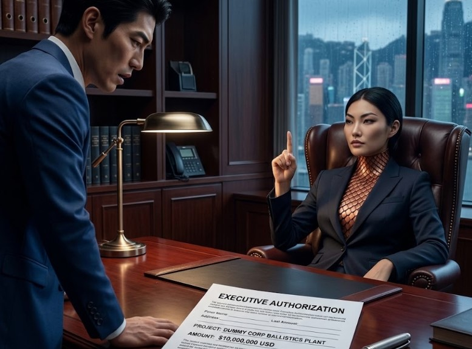

**Chapter 12: Artificial Flavoring**
---
To the mundane, algorithmic world of high finance, Woo Telecom had stabilized perfectly. The stock had rebounded, the aggressive OSHA fines were quietly paid, and the grieving widow, Yeongon, had stepped up as the acting Chairwoman with a ruthless, clinical efficiency that terrified the surviving board members into absolute submission.

To Jin Woo, those four months were a suffocating, waking nightmare. For the remaining soulless husks that served on her board, it was an anxiety-ridden purgatory; they all wondered in their subconscious exactly how and when she would end their lives. But Jin knew exactly what she was. He lived in a state of constant, high-functioning paranoia. He stopped sleeping in his own apartment, rotating between high-end hotels under assumed names. He flinched every time the HVAC system in the corporate tower hummed, constantly checking the ambient temperature. He was funneling millions of dollars into Elias Thorne’s ballistic-seal manufacturing facility in Busan, but every single day he walked into the executive suite, he felt the crushing, gravitational weight of the predator sitting comfortably at the top of his food chain.

"Mr. Woo. The Chairwoman requested your presence in her office," the executive assistant murmured, her eyes locked nervously on her monitor as Jin stepped off the private elevator.

Jin’s jaw tightened. "Thank you."

He walked down the silent, heavily carpeted hallway. The heavy acoustic doors to the CEO’s suite were open. Yeongon sat behind the massive slab of polished mahogany that used to belong to his grandfather. The human suit was holding flawlessly. She wore a tailored, charcoal-grey blazer over a high-collared silk blouse, her dark hair pulled back into a severe, architectural knot. She was typing on a holographic terminal, her pale, flawless fingers flying across the keys with an unnatural, blurring speed that no human tendon could sustain.

She didn't look up as Jin entered. "Close the door, Jin." Jin closed the heavy door and silence in the room became absolute, a localized vacuum.

"The Q3 projections are robust," Yeongon said, her voice smooth and entirely devoid of mammalian inflection. "The liquidation of the Daejung assets following CEO Han's... unfortunate accident... has provided us with immense liquidity."

"We are well-positioned," Jin agreed, keeping his posture rigidly neutral. He stood exactly ten feet from her desk, his tactical brain silently calculating the sprint distance to the door.

Yeongon finally stopped typing. She rested her hands on the desk and looked up. Her eyes—dark, bottomless voids that seemed to actively absorb the ambient light from the floor-to-ceiling windows—locked onto his.

"I was reviewing the operational expenditures for the quarter," she said smoothly, tapping a single key to bring up a highly classified financial ledger on the monitor between them. "I noticed a significant capital bleed in a subsidiary. Advanced Environmental Acoustics. A facility in Busan."

Jin felt the blood drain entirely from his face. His heart rate spiked, but years of brutal corporate conditioning kept his expression frozen in a mask of polite indifference. "It’s a risk-management initiative, Chairwoman," Jin lied seamlessly. "Following the structural failure in the vault and the police involvement, I authorized R&D into specialized acoustic dampening and environmental hazard containment. To ensure Woo Telecom is never legally liable for a psychological incident of that magnitude again."

Yeongon stared at him. The silence stretched for five agonizing, suffocating seconds. Then, she smiled. It was the same hollow, terrifying expression she had worn behind the ballistic glass in the vault right before the egos shattered.

"Environmental hazard containment," she repeated softly, tasting the corporate jargon on her tongue. "How ambitious. Tell me, Jin. Does this containment protocol involve forty-millimeter riot rounds and synthetic polymers?"

Jin stopped breathing. She knew about Elias, she knew about the ballistic seals. She had obviously been reading the black-budget R&D manifests.

"I..." Jin started, his brilliant mind scrambling desperately for a defensive pivot.
Yeongon raised a single, elegant finger, instantly silencing him.

"You don't need to lie to me, Jin. It’s insulting to both of our intellects," she murmured, leaning back in the heavy leather chair. "I absorbed fifty of the most brilliant, corrupt financial minds in Asia. Do you honestly believe you can hide a multi-million-dollar ballistics manufacturing plant in my own ledger?"

"Tsk tsk." She reached into the breast pocket of her blazer and pulled out a sleek, titanium pen. She leaned forward, signed her name across a physical paper requisition form, and slid it across the mahogany desk toward him.

Jin looked down at the paper. It was an executive authorization, approving an additional ten million dollars in funding for his dummy corporation.

"I am approving your budget," Yeongon said, her voice dropping into that chilling, liting resonance that bypassed Jin's ears and vibrated directly in the roots of his molars.

Jin stared at the signature, his cognitive functions completely gridlocked. "Why?"

"Because a parasite only learns how to survive if you give it an immune response to fight," Yeongon whispered, her eyes flashing with a sudden, iridescent, oil-slick sheen. "Build your cages, Jin. Buy your guns. Paint your little red lines. I want you to feel entirely secure in your containment strategy."

She stood up, buttoning her blazer. The heavy, metallic clink of the tungsten clasps hidden beneath the silk fabric echoed loudly in the quiet room. "Because when I finally audit you," she said, walking past him toward the door, "I don't want you to have the excuse of being underfunded. I want you to know you spent my money, used my resources, and still completely failed."

She paused at the door, looking over her shoulder. "Target number fifty-two was an organ broker in Itaewon," she noted casually. "I’m taking the weekend off to attend a gala in Jeju next week. Number fifty-three is a shipping magnate who traffics humans in his cargo containers. If your contractor wants to test his new toys, tell him to bring an umbrella. It’s supposed to rain."

She walked out, leaving Jin alone in the silent office, staring down at the fully funded, approved budget of his own impending death. He noticed his new mate was nowhere to be found.

Two hours later, in a sterile safe house on the outskirts of Seoul, Elias Thorne listened to Jin recount the meeting.

"She funded us," Jin said, pouring himself a rigid two fingers of scotch and downing it in a single swallow. "She knows exactly what we are manufacturing, and she wrote a blank check for it."

Elias sat on the couch, running a whetstone methodically down the edge of a heavy tactical combat knife. Rolo, his massive ninety-nine-pound European Doberman, rested his chin heavily on Elias’s knee, his dark, intelligent eyes watching the rhythmic scrape of the blade.

"She’s arrogant. And she has the capital to be," Elias replied, his voice a low rumble. He set the knife down. "But it changes nothing about the operational mechanics. Rolo is dialed in. I’ve run him through three mock ambushes in urban environments. The moment her thermal or pheromone baseline drops, he flags her. We have the advantage of early detection."

"You need to verify the payload," Jin snapped, pacing the floor. "Take it back to the mountain. If she knows we are printing the seals, I don't trust the math. Something is wrong."

Elias agreed and later after Jin had left he packed the latest batch of 3D-printed cinnabar seals into a highly pressurized steel case and drove up to Inwangsan Mountain under the cover of darkness.

The Mansin was waiting on the wooden porch of her shrine, smoking her thin, unfiltered cigarette in the cold night air. Elias opened the case, revealing the perfectly printed red geometric Bujeok talismans. The old woman didn't look impressed. She picked one up, closed her milky eyes, and rubbed her thumb over the cured red ink.

She spat on the ground. "It is dead," the Mansin rasped, tossing the million-dollar prototype back into the steel case like a piece of garbage.

"The lines are flawless," Elias argued, his frustration bleeding through. He pointed to the laser-precise lines. "It’s exact to the micron. And I specifically ordered organic earth compounds for the extrusion feed."

"The lines are the cage, American. The ink is the lock, and this ink is not the blood of the earth." The Mansin crushed a piece of the red paste between her fingers, bringing it to her nose. "It is synthetic iron oxide. Machine rust and artificial flavoring. It will not hold the weight of a celestial beast."

Elias’s blood ran cold. He pulled out his encrypted phone and rapidly checked the corporate supply-chain manifests for the Busan lab. He found the discrepancy buried beneath three layers of shell companies. Yeongon hadn't just funded the lab; she had used her authority as CEO to quietly switch the raw materials vendor two weeks ago. She let them build their flawless geometric cages, but she secretly replaced the locks with plastic.

"She sabotaged the supply chain," Elias muttered, staring at the screen. "The Jeju gala is in four days. We don't have time to resource raw organic cinnabar, process it for the extruders, and reprint the arsenal."

"Then you will die in Jeju," the Mansin said simply, taking a drag of her cigarette.

Elias looked down at Rolo. The Doberman stared back, utterly unfazed by the logistics. "Not if I test the integrity of her human suit before we get there," Elias said, his tactical brain shifting from a containment strategy to a reconnaissance mission. He snapped the case shut. "I need to map her fracture points." He left Mansin with her smoking cigarette and haughty attitude without another word.

At 4:31 AM, the Woo Telecom CEO penthouse was a silent, pitch-black void. Elias bypassed the biometric security grid on the private elevator using a cloned executive badge Jin had coded with absolute clearance. When the polished steel doors slid silently open, Elias stepped into the dark foyer. Rolo was at his heel, wearing a dark stealth harness, utterly silent and perfectly disciplined.

Elias was not wearing his standard tactical vest. He knew a ballistic plate wouldn't stop her kinetic force. Over his torso, he wore an experimental kinetic-dampening rig—a lightweight, carbon-fiber exoskeleton designed specifically to absorb blunt-force trauma. Around his neck sat a heavy, industrial active-noise-canceling collar, calibrated to emit a localized sonic shield against a 12-Hertz acoustic flutter.

He moved into the massive, open-concept living room, his boots making no sound on the marble. "You know, Elias," Yeongon’s voice echoed smoothly from the deep shadows near the floor-to-ceiling glass. "Sneaking a dog into a high-rise violates several building codes."

She stepped into the moonlight. She wore a simple, flowing silk nightgown with a tungsten inlay corset, her pale skin glowing faintly in the dark.
Elias didn't speak. He tapped the activator on his collar. A low, electronic hum enveloped him.

Yeongon unhinged her jaw slightly, the skin parting with terrifying ease, and released her liting, three-note whistle. Fffff... Ddddd... Aaaaa...The sound hit Elias’s collar and dissolved instantly into harmless, buzzing static. The psychoacoustic weapon was neutralized.

Yeongon’s eyes narrowed, a flash of genuine irritation crossing her flawless face. "Clever boy." She murmured.

"Rolo, Fass!" Elias commanded.

The Doberman launched forward like a ninety-nine-pound missile, clearing the distance in a single, explosive bound, his powerful jaws snapping wide to lock onto Yeongon’s forearm.

The dog’s bite force was over 600 PSI. Yeongon didn't even flinch. She simply twisted her arm, using the dog’s own forward momentum to throw Rolo across the polished marble floor. The Doberman scrambled, his claws clicking frantically as he righted himself instantly, completely uninjured but visibly confused by her unnatural, stone-like density.

But Elias used the distraction perfectly to close the gap. He drove forward, slapping one of the 3D-printed synthetic seals directly onto her chest. The synthetic cinnabar flared, glowing a dull, sickly orange.

For a fraction of a second, Yeongon was rooted to the spot. Her eyes widened, a flicker of genuine shock crossing her face as the physical mass beneath her skin was violently compressed by the sudden cage.

Then, she laughed. The synthetic iron oxide couldn't hold the weight of fifty-one souls. The polymer talisman shattered, bursting into a cloud of useless, burnt ash.

Before Elias could draw his combat knife, she was on him. She moved with impossible, frictionless speed, her pale hand clamping around his throat like a steel vise. She slammed him backward into a concrete structural pillar. The carbon-fiber rig absorbed the worst of the impact, saving his spine from snapping, but the sheer kinetic force still caused a hairline fracture at his collarbone.

Elias gasped, his vision swimming, as she lifted him entirely off the floor with one hand.

"You brought a broken lock to a vault, Elias," she whispered, her eyes shifting into that terrifying, oil-slick black void.

But Elias wasn't struggling as he dangled from her grip. He wasn't trying to break her grip, he was observing. Because the synthetic seal had temporarily engaged, it had forced her physical celestial mass to violently react and compress. As she held him in the air, the ambient temperature in the room skyrocketed. Elias stared directly at the back of her neck.

A fracture point. He thought. There… right along her spine, the flawless human skin had split under the sudden pressure, revealing a jagged line of interlocking, heavy copper and obsidian scales. 

Blistering heat poured off the fissure in visible waves. When she compressed her mass to fight, the human suit couldn't properly ventilate the heat. If she expanded too quickly in an enclosed space, her mobility would drastically drop as the suit failed to regulate the thermodynamic pressure.

He didn't need the seal to kill her. He needed to overheat the engine. Rolo lunged again, biting down hard on Yeongon’s calf. With a frustrated sigh, she dropped Elias and kicked the dog away, sending Rolo sliding into the base of a heavy glass coffee table with a thud and a forced small yelp.

Elias hit the floor, coughing violently, but he immediately grabbed the handle on Rolo’s tactical harness and dragged himself backward toward the open elevator doors.

Yeongon didn't pursue them. She stood in the center of the ruined living room, smoothing down her silk nightgown, her spine already visibly knitting back together as the ambient heat dissipated.

"I told Jin to bring you an umbrella to Jeju," she called out as the polished steel elevator doors began to close on Elias’s bruised, bleeding face. "You’ll need a body bag, instead."

The doors shut, locking the predator away. Elias leaned back heavily against the steel wall of the elevator, spitting a mouthful of blood onto the floor. A dark, victorious smile cracked his face as his calloused hand rested on Rolo’s nape. Rolo was panting heavily and thirsty, but otherwise completely unharmed given all the protective gear Elias had outfitted him with. “Good boy.” He stroked Rolo, who seemed quite pleased with himself for holding the line against a god.

They had the data. Now, they just needed a furnace.
