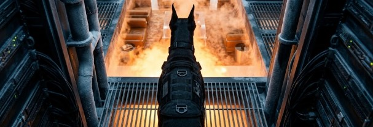

**Chapter 13: En Flambe**
---
The Jeju Island Art Pavilion was a masterpiece of organic residential architecture, suspended precariously over jagged volcanic cliffs by a series of heavy, cantilevered steel beams. Inside, the charity gala hummed with the quiet, expensive murmur of the Asian elite. Outside, a torrential Pacific typhoon battered the reinforced floor-to-ceiling glass, threatening to rip the building from the bedrock. But the occupants inside watch with their champagne glasses and their million dollar suits, ties and dresses, tipping the glasses upwards in celebration as the raw fury of the sea is shown to them as if a show coordinated for this occasion.

Elias Thorne was perched in the darkened server room directly above and across from the VIP lounge. He wasn't just armed with a tablet wired directly into the Pavilion’s environmental control mainframe. Slung across his chest was a modified, 40mm rotary grenade launcher, loaded with six heavy brass casings packed with the organic, earth-blood cinnabar he had purchased from Bora's shop.

Beside him lay Rolo. The massive European Doberman wore a specialized, matte-black stealth harness. He was completely silent, his dark, intelligent eyes scanning the heavy aluminum air vents.

"Target fifty-three is isolated," Elias murmured into his comms, his voice a low, tactical hum.

Down on the floor, Chairman Bae—a shipping magnate whose cargo containers moved far more than just electronics—excused himself from a circle of nervous investors. Sweating and looking over his shoulder, he headed toward the secluded, glass-walled VIP lounge overlooking the stormy, churning ocean.

Three hundred miles away, in the command center of the Woo Telecom penthouse in Seoul, Jin Woo was watching the hacked security feeds. He sat in his leather chair, a glass of scotch in his hand.

Directly above Jin’s monitors, hanging upside down from the ceiling tiles, was his celestial shepherd—the Opiliones. Bunnie’s eight spindly legs twitched in anticipation, its false yellow eyes locked onto the glowing screens, Jin could tell that it could taste the static tension bleeding through the digital feed.

"I don't have eyes on her, Elias," Jin said smoothly into his headset. "The thermal signatures on the main floor are all reading a standard 98.6 degrees."

“Grrrrrrrr.” Elias froze. Rolo hadn't barked, but the dog’s hackles suddenly stood straight up, forming a sharp, rigid ridge of fur straight down his spine. The Doberman’s upper lip curled back, emitting a concussive vibration so low Elias actually felt it hum in his own cracked ribs. Rolo’s wet nose was pointed squarely at the floor grates leading down to the VIP lounge. Digital thermals could be spoofed, but the chemical shift of an apex predator dropping its temperature could not hide from a canine’s sensitive olfactory bulb. 

"She's in the lounge," Elias took three steady box-breaths and said, his heart rate steadying into an icy, analytical calm. His calloused fingers flew across the tablet. "Initiating."

Down in the VIP lounge, the heavy acoustic doors slid shut, sealing Chairman Bae inside. A moment later, Yeongon stepped out from the deep shadows of the coat check.

She wore a floor-length, structural gown of absolute black—a color that didn't just lack light, but seemed to actively absorb the ambient glow of the room. The gown was heavily corseted, locked shut across her ribs by thick, industrial tungsten clasps that mirrored her everyday coat.

She glided toward Chairman Bae, her pale jaw unhinging just a fraction of an inch to release the three-note business card. Before the first note left her lips, Elias hit the override with a confident grin.

He didn't attack her with acoustics or synthetic seals this time. He targeted the environment. He slammed the environmental blast doors shut, hermetically sealing the VIP lounge, and instantly cranked the localized ambient heating coils to maximum industrial capacity. Within ten seconds, the temperature in the lounge violently spiked to 115 degrees Fahrenheit. Within twenty seconds, it hit 130.

Down in the lounge, Chairman Bae gasped, frantically loosening his silk tie as the oppressive, suffocating heat hit him like a physical, suffocating wall. "What the fuc-" as he loosens his collar sweat violently beading up on his hairline.

For Yeongon, it was catastrophic. Her human suit relied entirely on ambient cooling to manage the immense, burning celestial energy of fifty-one compressed corruptions. As the room became the furnace, the suit losses its ability to stabilize. Yeongon stopped dead in her tracks. A sharp, shockingly human gasp of pain escaped her pale lips. She staggered backward, her hip hitting the edge of an obsidian coffee table. The heavy tungsten clasps on her gown began to hiss violently, the metal visibly warping and bending outward under the rapidly expanding heat of the celestial mass beneath her skin. She grabbed it to try and help it hold with her hands but her hands just glowed from beneath.

"She's at limit!" Elias noted, watching his monitors as the temperature gauge climbed past 140 degrees. "Bullseye..." He reported but before Elias could aim his 40mm launcher to deliver the organic seal, the security feed abruptly distorted. The heavy, magnetically locked steel doors of the VIP lounge didn't open, they gave way to a single man. The steel frame bent inward like pulled taffy, the atomic structure of the door simply folding out of the way. A man in a perfectly tailored charcoal suit stepped into the 140-degree room.

Up in Seoul, Bunnie, hanging over Jin’s monitors, let out a sharp, violent hiss of pure static, scurrying backward across the ceiling and hiding in the shadows that flickered about. "Elias," Jin said, his voice entirely losing its sociopathic cool. "Who the hell is that?"

"I don't know," Elias grunted, gripping his launcher and sliding out the door of the room so he. "You think it's the cleaner that Bora warned me about?" Gritting his teeth as he squared up the launcher just in case, after giving Rolo the stay hand signal. Couldn't have his buddy getting hurt in that mess even as his teeth bared and nose pointed at the scene poised and ready for the command.

Yeongon wasn't going to wait to find out what the man was going to do but she had a sliver of an idea. She launched at Shin letting a hand grow a fierce claw on the end of her hand and launching so quick that her trail was left in the lack of steam before it rolled back into where she occupied the space. She appeared in front of him and jabbed her razor sharp claw through Shin's chest cavity. He looked down his face stone dead with expressions but it was clear that caught him off guard but it didn't hit it's mark as space distorted around the blades with precision, not a single cut got through. 

She slide back using the condensation covered marble to gain an arm's length as she recoils. Just as I thought, he can't manipulate space/time in reality without his foci. Only his self without whatever that is in there._ her eyes dart to the pocket he keeps reaching for. Shin squares his face onto hers and continues to reach into his pocket. She covers the distance at an ambush angle before anyone blinks and slashes from his back to the front at a downward angle targeting only the coat pocket he reaches into. The pocket-watch 'tinks' onto the ground and begins twirling like a spinning top away from the two, driven by the slick floor. Shin crosses the room quickly and bends to pick up the watch as Elias puts Yeongon in the sights and squeezes the trigger to prime.

Yeongon gives a lopsided toothy grin as in enjoying the fight and launches with one step and pulling down into a slide her stilettoed foot aiming at that watch as Shin tries to get to it. She hits it squarely with the tiny pointed heel and it becomes alive beginning to bounce off the walls and Shin watches it closely. She grabs his coat shoulder shoulder to slow her inertia and to dodge the grenade launched at her by Elias perched with Rolo. The grenade hits the glass with a massive impact and a crack is left behind from the explosive earth blood.

A group of onlookers, thinking it's part of the show congregate at the windows next to the warped door. A few clings of champagne happens whenever a blow is landed on the man that cannot be harmed. A couple of shrieks when the glass cracks and Bae yells out in fear. 

Then with everything she has she drives her claw up through Shin's under chin with and upper cut. Shin looks into her black swirling eyes through the spatial distortions keeping him from being harmed as she lets go of his coat and slides to a stop on her heel. She looks up at Shin with a wicked grin her teeth blue and razor sharp stretching her face eerily, she was certainly taking out some aggression on this golem sent by Heaven's courts.

He lifts the watch and her eyes don't leave the thumb about to hit the switch. With just enough time she launches again and prepares to knock that watch into the glass crack but her back meets one of Elias' grenades fitted with perfect Bujeok.

He caught the watch as it pinging about the room and eventually landed in his hand. He simply looked at Yeongon and clicked it open, the game began. 

A localized spatial compression directly onto Yeongon. Down below, the physical toll on the her was horrifying. Trapped between Elias’s thermal changes, well-made Bujeok compressing her heat, and Shin’s spatial gravity crushing her inward, Yeongon fell heavily to one knee cracking the floor beneath. Along her spine, the flawless human skin blistered and split open with a sickening, wet crack. A jagged line of heavy, iridescent copper and obsidian scales erupted through the ruined flesh, radiating intense waves of visible heat distortion. Her body gave in to have her face pressed against the floor looking to Chairman Bae and gave a bloody wicked grin.

Chairman Bae, terrified by the suffocating heat and the mutating, bleeding woman on the floor, scrambled backward against the floor-to-ceiling glass. "What... what are you?!" he choked out, his mind fracturing as the dragon began to violently tear its way out of the tailored gown.

Shin took a single, calm step forward,  through the spatial glitch and instantly crossed twenty feet, appearing directly over Yeongon. He calmly raised a gloved hand to flatten her out of existence, as if just another day and another job.

Yeongon looked up, her dark eyes entirely swallowed by an oil-slick black void. She was pinned by the heat and crushed by the gravity, unable to unhinge her jaw or exert the psychological control she needed to extract Bae's soul cleanly. But she was an apex predator, and predators adapt. If I cannot survive the environment, she thought, her lightless eyes locking onto the structural foundation of the room, I will collapse it. Still on one knee, Yeongon slammed her pale, bloodied face directly into the floor, spraying her black oily blood into the cracks in the floor. She channeled the violent, expanding kinetic fury of her overheating form away from her body and drove it straight into the architectural load-bearing beams holding the cantilevered pavilion over the ocean.

_CRACK._ Some of the onlookers cheered her raising their glasses and then shrieked as the floor groaned underneath their feet.

The acoustic dampening of the room violently inverted. The massive steel I-beams groaned under the impossible celestial weight and the reinforced glass wall behind Chairman Bae didn't just shatter; it exploded outward into the raging storm. The gale-force winds of the Pacific typhoon howled into the 140-degree room, instantly violently crashing against the heat, creating a deafening, sensory-crushing vacuum of steam and rain.

Chairman Bae screamed, clutching his ears as the sudden, violent atmospheric pressure drop ruptured both of his eardrums and blood now framed the sides of his neck. The sheer terror of the storm, combined with the crushing, psychic weight radiating from the two gods clashing in front of him, broke his ego instantly. He fell to his knees in the rain-slicked lounge, weeping, his mind collapsing under the weight of the thousands of lives he had locked in dark, suffocating shipping containers.

The freezing rain poured over Yeongon, instantly quenching the thermal overload of her suit. Steam aggressively hissed off her exposed scales. She breathed in sharply through her teeth, absorbing the 53rd soul not through a physical bite, but by pulling the fractured energy directly through the chaotic, swirling air of the storm.

Shin’s spatial compression wavered as the physical architecture of the room collapsed around him and swallowed up the onlookers under blood stained concrete and stabbing twisted rebar. Pearched on the mezzanine, Elias watched the scene in stunned horror. She had been physically compromised, her suit literally melting, yet she had just weaponized the weather and his own architectural trap to finish the job. He pushed back down admiration.

Soul consumed, Yeongon stood up. Her gown was ruined, hanging in charred strips. Thick, dark blood—ink-black and viscous—spilled from the fissures in her neck where the scales had pushed through. She looked up at the ceiling, locking eyes with the hidden camera she knew Jin was watching through. She didn't smile she just stared. 

Then she looked to the petrified Elias and Rolo up on the dark mezzanine above and gave a single, respectful nod to the American contractor and the Dragon Hunter canine who had finally managed to make her bleed. Then, she turned and stepped backward out of the shattered window, melting seamlessly into the torrential rain and the dark drop to the ocean below, letting the storm hide her flighted escape leaving the last shreds of her dress to flow in the ocean eventually.

Shin stood in the ruined, wind-blasted lounge as the dust and vision cleared. He didn't pursue her. He simply clicked his silver pocket watch shut, stepped carefully over the weeping, lobotomized and departed husk of Chairman Bae, and the concrete pit of the rest of the elites that stayed to watch the show. Shin, without expression change walked back out through the warped steel doors.

Elias let out a long, heavy breath, resting his calloused hand on Rolo’s head to calm the vibrating dog. Target fifty-three was gone and the cleaner was here. Elias picked himself and his things up and went to the monitor. He zoomed in on the security feed, staring at the pool of dark, viscous liquid Yeongon had left behind on the shattered marble. A grim, terrifying satisfaction settled heavily in his chest. He readies his things to get the hell out of here before someone comes asking questions.

She bleeds, Elias idly thinks as he packs up, his tactical mind rapidly calculating the new data. She has a limit and his tools now work.

"Elias," Jin’s voice crackled over the comms, stripped of all its corporate arrogance. "What is our operational status?"

"The trap works, Jin," Elias replied, ejecting a 40mm organic cinnabar round from his launcher and catching it in his hand. "But the board just changed. We don't just have a dragon to hunt anymore. We have a celestial cleaner to deal with. And I'm getting the hell outta here!"

