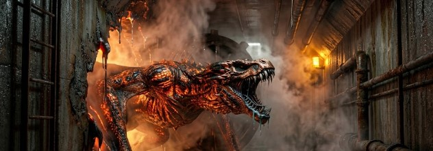

**Chapter 15: The Reduction**
---
The subterranean deep-freeze beneath the Ulleungdo compound hummed with the massive, rhythmic thrum of six industrial HVAC turbines. The ambient temperature was a bone-chilling fifteen degrees Fahrenheit, creating a heavy, dry cold that instantly aggressively attacked exposed skin.

Elias Thorne dropped silently from the aluminum ventilation shaft into the concrete maintenance corridor. Rolo landed heavily beside him, the massive European Doberman instantly shaking a layer of white frost from his sleek black-and-rust coat.
Elias didn't waste time shivering. He wired his tactical tablet directly into the primary environmental control junction box, his calloused fingers bypassing the biometric firewalls with practiced, mechanical efficiency.

"I’m in," Elias whispered into his comms, his breath pluming into thick white clouds.

Three hundred miles away in Seoul, Jin Woo was pacing his empty executive suite like a caged raven. "Do it. Burn her out."

Elias bypassed the thermal limiters. He didn't just turn off the AC; he forcefully reversed the flow. Deep inside the walls, massive compressor valves violently slammed shut. Elias triggered the localized heating coils to dump raw, unfiltered thermal energy directly into Yeongon’s containment cell on the other side of the heavy blast door.

The digital thermometer on his tablet spiked, the numbers rolling over like a slot machine: 50°F... 80°F... 120°F.

"Grrrrr." Rolo backed away from the heavy steel door, his hackles raising into a sharp, rigid ridge. The dog wasn't reacting to the heat; his biological radar was sensing a catastrophic, violent shift in the room's atmospheric pressure.

Behind the steel, a sound began to build. It wasn't human. It was a wet, tearing sound of flesh giving way, followed by a guttural, multi-toned screech that violently vibrated the rebar inside the concrete floor.

"Her mass is expanding," Elias noted, his hand resting heavily on his customized liquid-nitrogen rifle. "The suit is failing."

But the numbers on Elias’s tablet started flashing a critical, crimson warning. It wasn't just the heat that was rising. The ambient acoustic pressure in the containment cell was multiplying exponentially, building a hydrostatic wall of sound.

Through the heavy steel door, Yeongon unleashed the frequency.

It wasn't the controlled, liting three-note whistle of a surgical extraction. It was a raw, unhinged blast of the 12-Hertz flutter—a psychoacoustic shockwave amplified by the agonizing heat melting her human flesh.

The frequency hit Elias like a physical, blunt-force blow to the skull. His heavy, active-noise-canceling collar sparked, hissed, and shorted out, entirely unable to process the sheer mathematical density of the sound. He dropped to his knees, clutching his head as his equilibrium violently spun off its axis. Rolo whined loudly, flattening his ninety-nine-pound frame against the concrete and covering his cropped ears with his paws.

Above them, in the luxury atrium, the shockwave ripped mercilessly through the floorboards.

Twenty-four of the world's most corrupt elites were instantly caught in the blast radius. There was no time for them to weep, beg, or confess. The sheer, crushing weight of their collective, suppressed guilt—decades of systemic exploitation, hidden bodies, ruined environments, and hoarded wealth—was forcibly slammed into their prefrontal cortexes simultaneously.

Their neural pathways literally shattered under the electrical load. Massive, reinforced glass panes fractured into spiderwebs. High-end crystal decanters exploded, showering the plush rugs with fifty-year-old scotch. Within three agonizing seconds, twenty-four billionaires collapsed to the floor in synchronized, catatonic silence, their egos popped like over-inflated balloons.

Down in the corridor, the heavy steel door to the containment cell groaned under the expanding pressure. The thick steel warped outward, the deadbolts sheared clean off, and the massive door blew off its hinges, slamming violently into the opposite wall.

A wave of suffocating, 160-degree heat rolled over Elias, clashing with the freezing corridor air to create a blinding, violently hissing wall of steam. Elias looked up, raising the liquid-nitrogen rifle with trembling arms, fighting his own spinning vertigo.
Yeongon stepped out of the boiling steam.

The tailored human suit was gone, shredded into burning, unrecognizable rags. Her true form was exposed, towering and terrifying. She stood on four massive, reptilian legs ending in sword-length, razor-sharp claws. Thick, iridescent coppery-obsidian scales covered her neck, shoulders, and chest, slick with a dark, viscous, oily fluid. Her jaw was permanently unhinged, revealing rows of silver, needle-like teeth shining past the copper and black scales lining her lips. The ambient air around her warped and rippled with blistering celestial heat.

She had just consumed twenty-four egos simultaneously. She was choking on the massive caloric intake of it, her armored chest heaving, but her eyes—lightless, ancient voids—locked dead onto Elias.

Elias didn't shoot. He was a tactician. He knew exactly when a board was completely lost.
But before Yeongon could take a single step toward the contractor, the structural geometry of the concrete maintenance tunnel violently folded. The heavy steel plumbing pipes lining the ceiling bent inward at impossible, right-degree angles, groaning as the spacetime was aggressively re-graded.

Shin stepped out of the warped concrete. He didn't look at Elias or the dog. He looked directly at the towering, superheated proto-dragon. He calmly pulled his silver pocket watch from his perfectly tailored charcoal suit and clicked it open.

"You are off-schedule, Auditor," Shin stated, his voice a flat, bureaucratic deadpan devoid of all resonance. "And you have exceeded your permitted caloric limit."
Shin didn't raise a hand; he simply took one step forward.

The localized gravity in the tunnel magnified by a factor of ten. Elias was instantly slammed face-first into the concrete, the experimental carbon-fiber of his suit screaming and cracking under the impossible hydrostatic pressure. Rolo was pinned flat to the floor, his ribs creaking, his powerful lungs struggling desperately to expand against the weight of the air itself.

The immense gravitational pressure hit Yeongon like a falling skyscraper, forcing her massive, scaled shoulders downward. The reinforced concrete floor beneath her cracked, spiderwebbing into a deep, pulverized crater.

But Yeongon was no longer holding fifty-one souls. She was holding ninety-nine.
She let out a multi-toned, metallic roar that shattered the remaining halogen light fixtures into dust. Her physical mass had become so incredibly dense that she began to generate her own, violently opposing gravitational pull. The localized spacetime Shin was attempting to fold simply shattered around her like cheap, defective glass.

She lunged with terrifying, frictionless speed, her massive scaled shoulder clipping Shin as she bulldozed straight through his spatial lock. The raw kinetic impact threw the celestial cleaner backward, embedding his flawless suit deep into the solid bedrock of the tunnel wall with a deafening crash.

Yeongon didn't pause to finish him. She stopped, looking down at Elias pinned to the cracked floor.

"Ninety-nine," she whispered. The voice didn't come from her throat; it resonated directly inside Elias's skull, a heavy, metallic vibration that tasted like ozone. "Go back to Seoul, Elias. Tell the boy the audit is closed. I am coming for my stairway to heaven." She laughed—a dark, reptilian rumble that violently vibrated the marrow in the bones of everyone around her.

She didn't run. She simply pushed through the warped, crushed corridor, leaving a heavy trail of scorched concrete and dark, boiling blood in her wake.

Embedded in the bedrock, Shin sighed annoyedly. He brushed a dusting of pulverized stone off his immaculate lapel while trying to pry his arm free from the perfect outline of himself in the stone, his other hand casually reaching for his ticking watch.

Elias forced himself up to his knees, his muscles screaming in protest as the gravity well dissipated. The comms unit in his ear crackled to life, filled with static.

"Thorne? Thorne, report. Did she burn?" Jin's voice was frantic, the mask of corporate indifference completely shattered.

Elias looked at Shin, who finally peeled himself out of the wall, adjusted his silk tie, and stepped into a spatial fold, vanishing from the tunnel entirely.

"Negative, Jin," Elias rasped, spitting a mouthful of blood onto the frost-covered concrete. "She leveled up. And the Firmament's cleaner is right behind her. You're out of meat shields. Mama, I’m comin' home."

