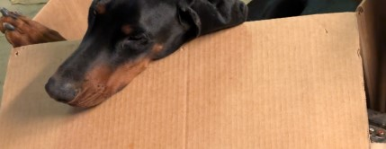

My dear Valka,

You asked me once if I missed the plush, orthopedic beds of our quiet homeland. The truth is, sister, the world is not in our dog beds. The world is out there.

I have recently returned from a rather harrowing journey with the American Ranger (the human who answers to Elias). He fancies himself a wizard of glowing boxes and invisible lasers, but as we both know, humans are dreadfully blind to the real shadows of the world.

Here is the tail of how we hunted the Great Serpent of the Joseon:

_An Unexpected Departure:_ We traveled to a volcanic isle across the great waters. The American Ranger stared through a black, elbow-shaped box at a dragon hiding inside a human dress. My snout told me immediately this was no woman, but an ancient, hoarding beast of fire and deep pressure. She whispered a dark, buzzing spell across the wind, and my handler nearly proved to me what I’ve long since suspected: that he is not house-trained. I covered him as he fled.

_Riddles in the Dark Alley:_ In a rain-soaked alleyway, we cornered a lesser ghoul. Suddenly, the Great Beast appeared, cloaked in black wool. The American Ranger, possessing far more courage than sense, tried to defeat her with a shiny brass trinket and a piece of cursed earth-blood paper. My eyes previewed her true form: she is a copper lizard with eyes blacker than mine and much larger than an elephant! I honestly don’t know how no one else sees her.

She simply flicked her wrist, and the air itself picked up and threw the Ranger into a pile of human-made wooden dog beds. She looked at me, pointed a single pale finger, and an invisible mountain dropped onto my back, pinning me flat against the wet asphalt. She told us to stop following her. I agreed with her entirely, then the crushing weight vanished. I tended to the dumb Ranger and helped him home to recover.

_The Oracle of the High Pines:_ We hiked up a treacherous, stony path smelling of sharp needles and ancient storms. At the summit sat a tiny wooden den, and on its porch sat a blind, withered human female blowing gray smoke. The American Ranger approached her as if she were frail, but my nose knew the truth. Beneath her wrinkled shell, her spirit was an ancient, gnarled tree rooted deep into the bones of the earth, thrumming with dangerous lightning. She looked directly at me with her cloudy eyes and respected me as a fellow hunter. She commanded the Ranger to abandon his foolish glowing boxes and gave him the true earth-blood paste to fight the Beast. For once, my handler submitted to a higher pack authority and listened.

_The Forging of the Earth-Blood Spell:_ We retreated to a subterranean forge of brushed steel. The Ranger crafted a new, blood-red rune. He stuck it to my chest armor to test its weight. It felt as though he had strapped a massive boulder directly to my spine. I let out a low, vibrating growl until he removed the foul thing. He finally understood the physics of magic.

_The Freezing Den and the Scentless Man:_ We tracked the Beast to an underground icebox to spring a trap, reversing the air to boil her out of her human skin. But before we could strike, another entity arrived. He wore a gray suit and carried no scent. Nothing at all. Like a dead stone. But he brought a gravity so heavy it crushed my ribs to the concrete. The Beast broke his invisible hold with her sheer, terrifying mass and escaped, leaving the scentless man embedded in the rock.

_The Rise of the Dark Queen:_ The hunt ended at a seventy-story glass mountain where a corrupted, exiled king sat on his throne of hoarded gold. The Beast finally shed her disguise, growing terrible, dark horns and expanding into miles of coiled copper and iridescent night. She shattered the primary load-bearing pillars of the tower, bringing the entire fortress crashing down into the dust just to crush the scentless man who had followed her. We barely escaped the fall of the tower, and the creature vanished into the storm.

We now reside in a secluded mountain sanctuary. The Ranger has finally thrown away his glowing boxes and paints the earth-blood runes by hand. The soup bones here are of acceptable quality, though I do miss the quiet mornings in the yard with you.

Also, do tell that 'Mazon guy to stop putting garbage things in the boxes he delivers! Every time I want to fitzsitz, there’s some dumb box weight in there.

Keep your paws warm, sister. The dark is full of terrors, but my teeth are very sharp.
Yours in eternal vigilance,

International Sieger Rolo aus dem Drachenhort, Son of the Midnight Sovereign, Grandson of the Carpathian King.

attachment.001.jpg>>

